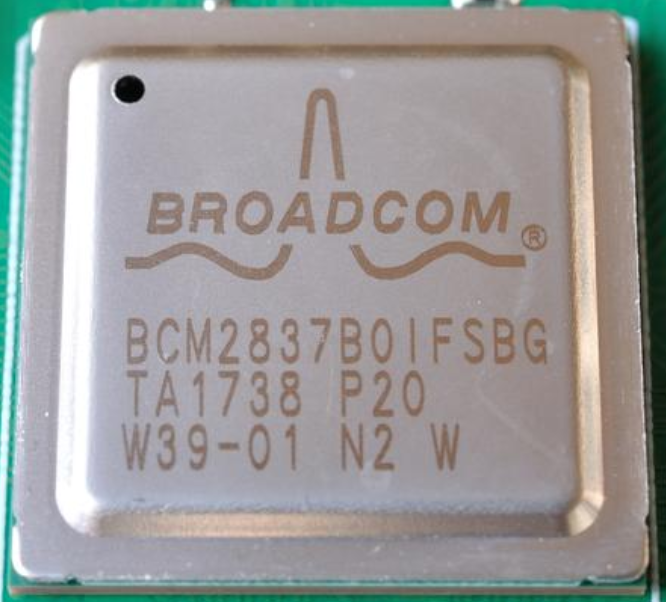
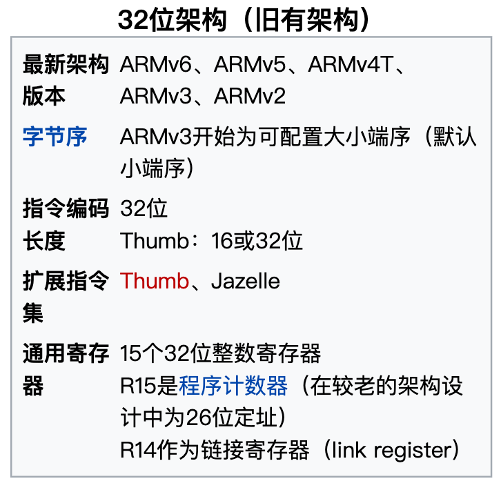
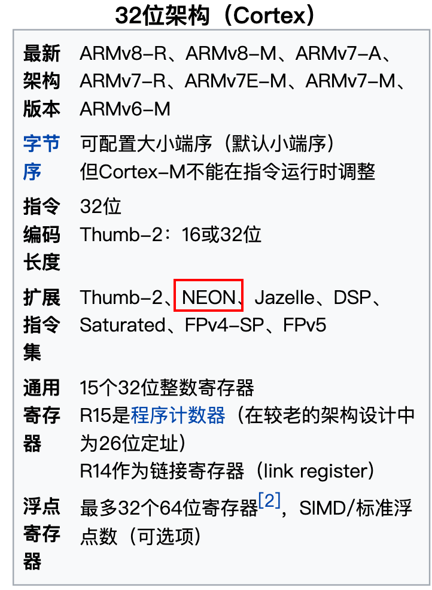
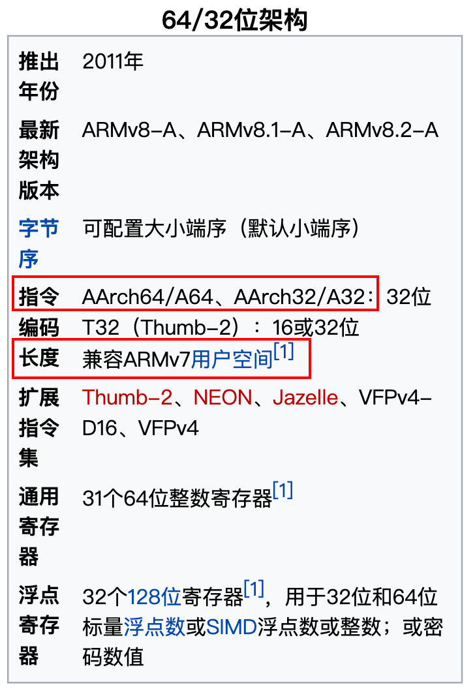
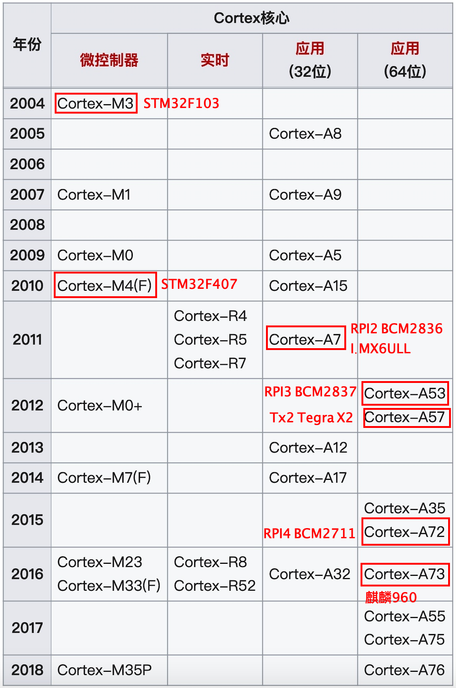

# 前言
&emsp;&emsp;一款ARM芯片相关的名字太多，经常搞不清楚都分别代表什么，本文就是梳理一下名字的含义层次并着重回顾一下芯片架构。  

&emsp;&emsp;BCM2837是产品的名字，是博通公司的一款SoC（CPU+RAM等外设都封装在一块SoC芯片里），这款SoC包含的CPU架构是ARMv8，这个CPU的名字是ARM Cortex-A53，aarch64和aarch32是ARMv8架构处理器的两种可选的执行状态，aarch64执行状态下支持A64指令集，aarch32和传统的32位指令集被称为A32指令集
|  名字   | 含义  |同级其他可能|
|  ----  | ----  |----|
| BCM2837  | 博通的SoC产品名 |STM32、I.MX6ULL|
| ARMv8-A  | CPU芯片的架构 |ARMv7|
|Cortex A53|CPU芯片的名字，也可以说BCM2837的内核是Cortex A53（有时候就简称A53）|ARM9、Cortex M3|
|aarch64|CPU可以运行的64位执行状态|aarch32|
# 32位旧有架构
- ARMv1是1985开发的样本，首颗量产的是1986年的ARMv2架构
- ARM7是ARMv4架构，ARM9是ARMv5架构，ARM11是ARMv6架构。这些都是2004年以前老架构芯片  

# 32位Cortex架构
- 2004年到了ARMv7架构的时候开始以Cortex来命名，并分成Cortex-A、Cortex-R、Cortex-M三个系列。 三大系列分工明确：“A”系列面向尖端的基于虚拟内存的操作系统和用户应用； “R”系列针对实时系统； “M”系列对微控制器[1]。
- NEON技术从ARMv7开始被采用，目前可以在ARM Cortex-A和Cortex-R系列处理器中采用。
NEON在Cortex-A7、Cortex-A12、Cortex-A15处理器中被设置为默认选项，但是在其余的ARMv7 Cortex-A系列中是可选项。NEON与VFP共享了同样的寄存器，但它具有自己独立的执行流水线[2]<suo>。

# 64位架构
- armv8架构的64位芯片既可以选择运行aarch64执行状态也可以选择运行aarch32执行状态，并且ARMv8架构的芯片支持32位的程序在64位的系统里运行

- 

# 时间线及几个常见芯片
- STM32F103芯片是Cortex-M3内核，ARMV7-M指令集架构
- STM32F407芯片是Cortex-M4内核，ARMv7-ME指令集架构
- 树莓派RPI A+/B+/Zero的BCM2835带的是ARM11内核
- 树莓派RPI2 B的BCM2836带的是Cortex A7内核
- 树莓派RPI3 B/B+的BCM2837带的是Cortex A53内核
- 树莓派RPI4 B的BCM2711带的是Cortex A72内核
- I.MX6ULL是Cortex A7内核
- Tegra X2（Jetson Tx2的SoC ）带四核Cortex A57+双核Denver 2（只知道是ARMv8架构不知道具体哪个芯片，具体不太懂没研究过）
- 海思的麒麟（Kirin）960、970是Cortex A73

# 参考资料  
[1]https://zhuanlan.zhihu.com/p/92315825  
[2]https://zyddora.github.io/2016/02/28/neon_1/  
[3]https://zh.wikipedia.org/wiki/ARM%E6%9E%B6%E6%A7%8B