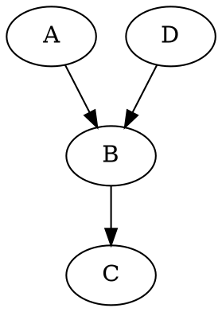

# 一级标题
## 二级标题


----
分割线


+ 无序列表，行之间无间距
+ 无序列表，行之间无间距
* 无序列表，行之间有间距
* 无序列表，行之间有间距
- 无序列表，行之间有间距
- 无序列表，行之间有间距
+ + 二级无序列表，行之间无间距
+ + 二级无序列表，行之间无间距
  + 二级无序列表，可以不要一级列表的符号

1. 有序列表
2. 有序列表


| 左对齐 | 右对齐 | 居中对齐 |
| :-----| ----: | :----: |
| 单元格 | 表内<br>换行 | 单元格 |
| 单元格 | 单元格 | 单元格 |


按键示例=<kbd>空格</kbd>+<kbd>空格</kbd>+<kbd>回车</kbd>


第一行末尾加上<kbd>空格</kbd>+<kbd>空格</kbd>+<kbd>回车</kbd>。  
第二行就会被换行。


[链接](www.baidu.com)


**加粗字体**
*斜体*
<font size=7>我是变大的字</font>
<big>字体变大</big>
<font color=yellow>我是黄色的字</font>


>引用


上角标<sup>[1]</sup>
下角标<sub>[2]</sub>


中间留小空格&nbsp;中间留小空格  
中间留中空格&ensp;中间留中空格（英文空格）  
中间留大空格&emsp;中间留大空格（中文空格）  

[图像语法参考链接](https://shd101wyy.github.io/markdown-preview-enhanced/#/zh-cn/diagrams?id=mermaid)
```flow
st=>start:开始
op1=>operation:操作
cond=>condition:选择
io=>inputoutput:输出
e=>end:结束
st->op1->cond
cond(yes)->io->e
cond(no)->op1
```
