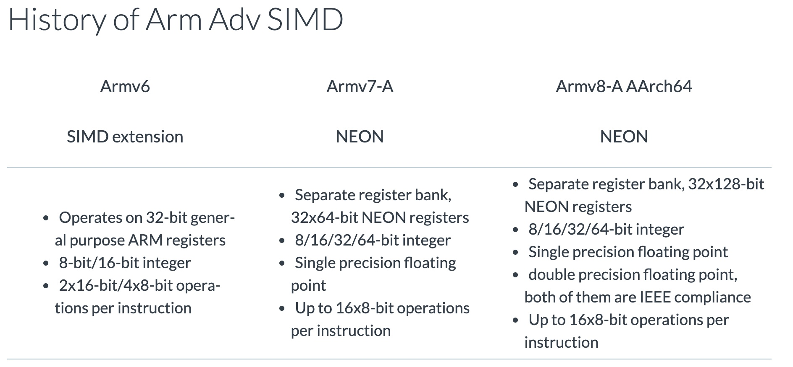
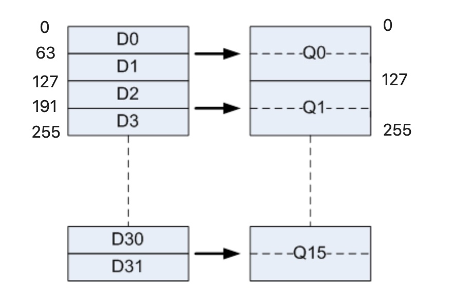
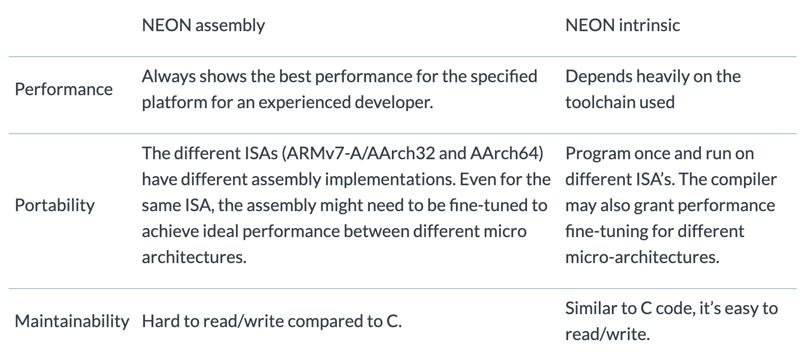
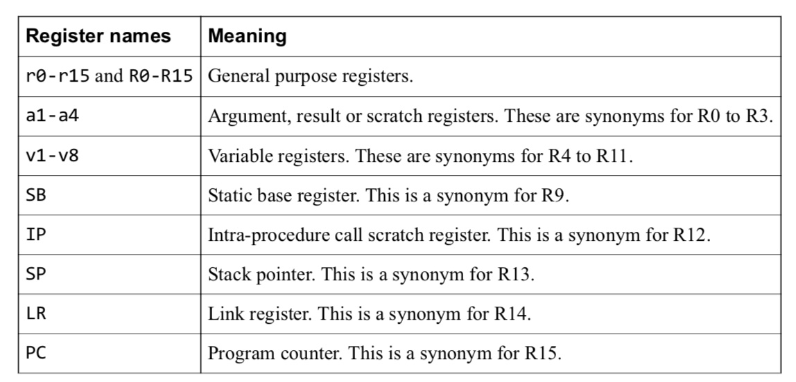
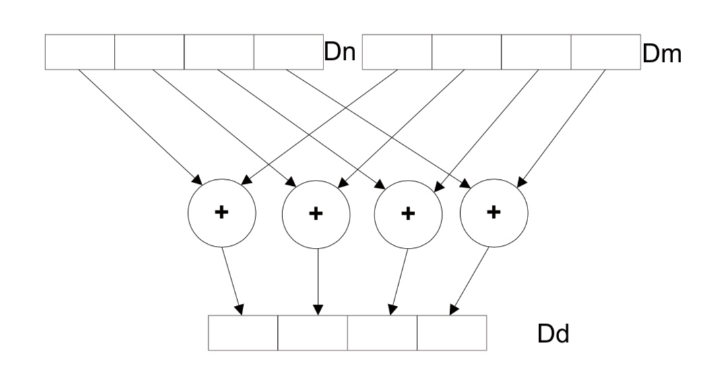

# 前言
指令集并行是CPU的优化加速的一个方向，在ARM芯片主要是利用NEON指令集实现指令集并行
# NEON简介
NEON就是高级SIMD，单指令多数据，适用于图像、音频等数据处理。ARMv6就叫SIMD，ARMv7开始叫NEON，aarch64又有点不一样，下文只针对ARMv7或者ARMv8 aarch32的NEON进行

NEON有32个64位长的寄存器(D0-D31，每个D可以装2个浮点数据)，也可以看做为16个128位长的寄存器(Q0-Q15，每个Q可以装4个浮点数据)，所以一句指令最多可以同时实现4个乘法操作，理论速度可以提升4倍

# 如何使用NEON
三种使用NEON的方法  
+ 库函数  
官方给了2个库可以使用，OpenMax DL和Ne10，后者在github上有，也是我用来参考学习的主要对象
+ 汇编函数  
  + 用汇编语句编写.s文件
  + 在C/C++代码中嵌入汇编语句(inline assembly)
+ 内联函数(intrinsics function)  
在C代码中直接嵌入内联函数用以实现功能，但是性能会取决于编译器和具体设备


# 汇编函数基础
想要高效利用NEON的话，汇编是避不开的。下面是ARM汇编相关的准备知识
+ 参考资料  
[汇编基础原理](https://azeria-labs.com/writing-arm-assembly-part-1/)  
[b、bx、bl指令](https://www.yxfseo.cn/post-97.html)  
[arm汇编指令](https://blog.csdn.net/gaojinshan/article/details/11534569)  
[GNU ARM Assembler Quick Reference](https://wenku.baidu.com/view/babb791aff00bed5b9f31d65.html)
+ 特殊寄存器
  
  TODO: sb、ip是干嘛的

+ 汇编函数文件directive(指令、伪操作)
  | 常见directive(指令、伪操作) | 参数 | 说明 |
  | :----:| :----:| :----: |
  |.text||后面那些指令都属于.text段|
  |.syntax|unified|说明下面的指令是ARM和THUMB通用格式<br>TODO:不太懂|
  |.align|4|4字节对齐|
  |.balign|4|TODO:不太懂|
  |.global|xx_func|函数xx_func可以被外部文件调用访问|
  |.thumb_func||指明一个函数是thumb指令集的函数<br>TODO:不太懂|
+ 编译调用汇编函数  
  编译汇编文件neon.s的命令需要加选项-mfpu=neon:
  ```bash
  arm-linux-gnueabihf-gcc -mfpu=neon -c neon.s -o neon.o
  ```
  主文件main.o链接neon.o的命令：
  ```bash
  arm-linux-gnueabihf-gcc neon.o main.o -o test
  ```
  [相关编译参数](https://www.cnblogs.com/SoaringLee/p/10532106.html)
+ 堆栈读取参数  
TODO:汇编读取多参数
[参考链接](https://bob.cs.sonoma.edu/IntroCompOrg-RPi/sec-arg-access.html)
+ ARM汇编基础指令
  + ldr  
  ldr R0, [R1]! @将内存地址为R1的数据加载到R0,并将R1指向下一个位置  
  ldr R0，[R1，＃8]   ；将存储器地址为R1+8的字数据读入寄存器R0。
  + str  
  str R0，[R1，＃8]             ；将R0中的字数据写入以R1＋8为地址的存储器中。
  + b 无条件跳转  
  b label_fun
  + bl 带返回的跳转，保存当前位置到lr，用于子函数调用  
  bl label_fun @bx lr或者mov pc, lr实现返回
  + bx 跳转并切换状态，一般用于子函数返回  
  bx lr
  + bgt 比较跳转，如果经过之前某句操作后状态寄存器是大于(great than)就跳转  
  cmp r0, #5  
  bgt label_foo
  + and 按位与  
  and               r3, r2, #3          @ r3 = r2 % 4
  + asr 右移  
  asr               r2, r2, #2          @ r2 = r2 >> 2
  + cbz 比较跳转，如果为零就跳到后面的指令  
   cbz               r3, label_foo
  + sub 减命令  
  sub r0, r1, r2 @ r0 = r1 - r2
  + subs 减命令，并更新状态寄存器  
  同sub一样，多的更新状态寄存器功能可以配合bgt

+ NEON矢量读取命令vld1  
  + ```armasm
    vld1.32         {d0}, [r1]@从内存地址r1开始读取2个32位数据到d0里，因为d能存2个32位浮点数
    ```
  + ```armasm
    vld1.32         {q0}, [r1]@从内存地址r1开始读取4个32位数据到q0里，因为q能存2个32位浮点数
    ```
+ NEON矢量存储命令vst1
  + ```armasm
    vst1.32         {d0}, [r1]@将d0里的2个32位浮点数写到内存地址r1里
    ```
  + ```armasm
    vst1.32         {q0}, [r1]@将q0里的4个32位浮点数写到内存地址r1里
    ```
+ NEON矢量加命令vadd  
图文并茂，不用多说
  ```armasm
  vadd.i16        d3, d0, d1         @ d3 = d0 + d1
  ```
  
# NEON简单对比实验
[github链接](https://github.com/HuangShiqing/neon_test.git)记得点赞
+ C语言实现
  ``` c
  void mul_float_c(float *dst, float *src1, float *src2, int count)
  {
      int i = 0, j = 0;
      for (j = 0; j < count; j++)
          for (i = 0; i < 4; i++)
              *(dst++) = *(src1++) * *(src2++);
  }
  ```

+ 汇编实现assembly
  ``` armasm
      .text
      .syntax   unified
      .align   4
      .global   mul_float_neon
      .thumb
      .thumb_func 

  mul_float_neon:
      @@@@@@@@@@@@@@@@@@@@@@@@@@@@@@@@@@@@@@@@@@@@@@@@@@@@@@@@@@@@@@@@@@@@@
      @  r0: *dst & current dst entry's address浮点型指针，存储结果
      @  r1: *src1 & current src1 entry's address浮点型指针，操作对象1
      @  r2: *src2 & current src2 entry's address浮点型指针，操作对象2
      @  r3: count,循环次数
      @@@@@@@@@@@@@@@@@@@@@@@@@@@@@@@@@@@@@@@@@@@@@@@@@@@@@@@@@@@@@@@@@@@@@
  .loop:
      cbz             r3, .return
      subs            r3, r3, #1
  
      vld1.32         {q0}, [r1]!
      vld1.32         {q1}, [r2]!        @ for current set
      @ calculate values for current set
      vmul.f32        q3, q0, q1         @ q3 = q0 + q1
      @ store the result for current set
      vst1.32         {q3}, [r0]!

      b               .loop
  .return:
      mov               r0, #0
      bx                lr

  ```
+ C语言内嵌汇编实现inline assembly
  ```c
  void mul_float_neon_inline(float *dst, float *src1, float *src2, int count)
  {
      asm volatile(
          ".loop:\n"
          "cbz             %[count], .return\n"
          "subs            %[count], %[count], #1\n"
          "vld1.32         {q0}, [%[src1]]!\n"
          "vld1.32         {q1}, [%[src2]]!        @ for current set\n"
          "vmul.f32        q3, q0, q1         @ q3 = q0 + q1\n"
          "vst1.32         {q3}, [%[dst]]!\n"
          "b               .loop\n"
          ".return:\n"
          // "mov               %[dst], #0\n"//不需要函数的返回跳转
          // "bx                lr\n"
          : // 解释返回参数,如[ dst ] "+r"(dst)，有个加号
          : [ dst ] "r"(dst), [ src1 ] "r"(src1), [ src2 ] "r"(src2), [ count ] "r"(count)// 解释输入参数
          : "memory", "q0", "q1", "q3");// 不太懂，但是要加
  }
  ```
+ 内联函数实现  
[内联函数官方在线文档](https://developer.arm.com/architectures/instruction-sets/simd-isas/neon/intrinsics)
  ```c
  #include <arm_neon.h>//要用neon内联函数必须要该头文件
  void add_float_neon(float* dst, float* src1, float* src2, int count)
  {
     int i;
     for (i = 0; i < count; i += 4)
     {
         float32x4_t in1, in2, out;
         in1 = vld1q_f32(src1);
         src1 += 4;
         in2 = vld1q_f32(src2);
         src2 += 4;
         out = vaddq_f32(in1, in2);
         vst1q_f32(dst, out);
         dst +=4;                       
     }
  }
  ```
+ 结果对比和分析
  ```bash
  pi@raspberrypi:~/mnt/neon_test $ ./neon_test 
  mul_float_c used: 0.000095 s
  mul_float_neon used: 0.000012 s
  mul_float_neon_inline used: 0.000011 s
  mul_float_neon_intrinsics used: 0.000059 s
  mul_float_c and mul_float_neon result same!!!
  mul_float_c and mul_float_inline result same!!!
  mul_float_c and mul_float_intrinsics result same!!!
  ```

  分别用C语言的for循环、neon的汇编实现、neon的内联汇编(inline assembly)、neon的内联函数(intrinsics function)这4种方式在A53上实现4*100次浮点运算，可以看出，最快的还是neon汇编实现，约10倍的速度提升，同时两种neon汇编的速度一样没啥区别，但是还是建议不用内联汇编，因为gdb没法debug，至于为什么会达到10倍的提升，一方面是neon的矢量乘法有4倍理论提升，还有就是读数据和存数据都是4倍提速。而neon的内联函数却只有不到2倍的速度提升，真辣鸡  
  TODO:上述实验数据是在编译优化参数为debug模式"-O0 -g"的情况下测出来的，但是release模式"-Ofast"会报错

# 总结
来，弄优化，学汇编，用NEON！手动狗头