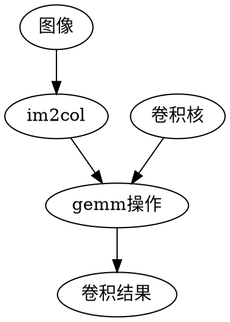
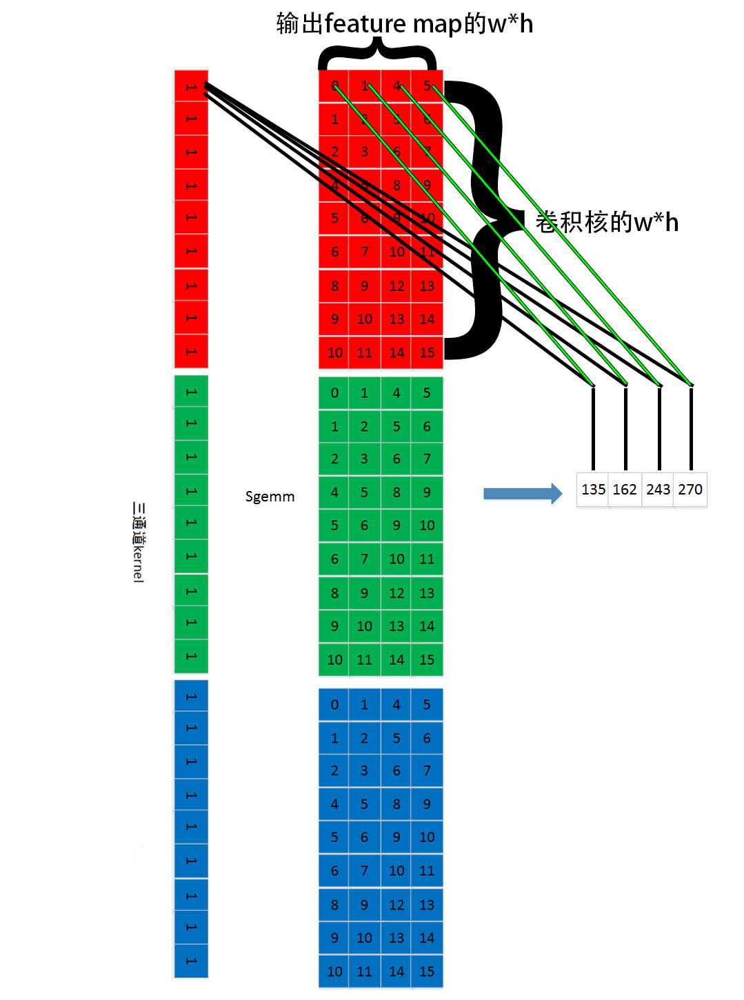
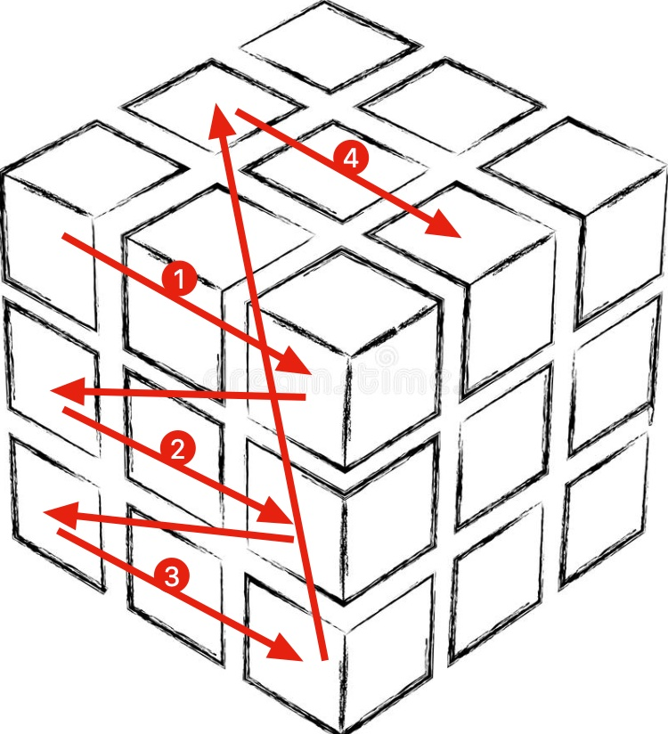
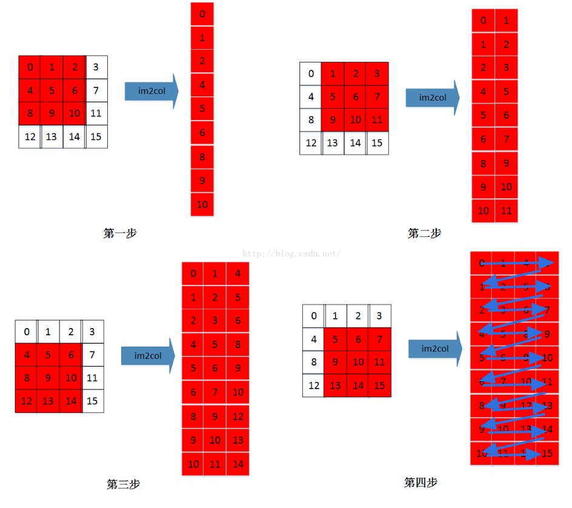

# 前言
主流框架包括caffe、tf、darknet实现卷积的时候不是直接进行卷积计算，而是往往采用im2col+gemm的方式来进行加速，加速的思路是“空间换时间”提高读取数据过程cache的命中。本文主要利用ARM的NEON汇编指令来加速darknet框架的CPU卷积计算
# darknet相关
## 卷积实现原理

[具体的im2col原理](https://blog.csdn.net/Mrhiuser/article/details/52672824)  
卷积实现时，卷积核第一个元素与经过im2col操作后的feature map的第一行对应的的每个元素先后分别相乘，结果值分别存到不同位置，如图中所示。然后以此类推，卷积核第二个元素和第二行的每个元素相乘，结果加到刚才的对应位置上。操作完第一个卷积核后再继续操作第二个卷积核，直到所有卷积核都被计算完

## 数据内存排布
+ 图像或者上一层卷积输出的内存排布

输入的图像或者feature map，内存连续分布，先放第一行，再放下一行，放完整个通道然后放下一个通道以此类推
+ im2col后的图像内存排布

每个卷积块的第一个元素先排在一起，然后是每个卷积块的第二个元素排在一起，以此类推
+ 卷积核内存排布
同图像内存排布
# NEON卷积对比实验
> darknet的矩阵乘法gemm代码:
``` c
void gemm_nn(int M, int N, int K, float ALPHA, 
        float *A, int lda, 
        float *B, int ldb,
        float *C, int ldc)
        //M=n,卷积核个数
        //N=输出feature map的w*h
        //K=k*k*c,单个卷积核的空间尺寸大小
        //ALPHA=1
        //*A=指向卷积核参数的指针
        //lda=K=k*k*c,单个卷积核的空间尺寸大小
        //*B=经过im2col的上一层feature map
        //ldb=N=输出feature map的w*h
        //*C=指向卷积结果的指针
        //ldc=N=输出feature map的w*h
{
    int i,j,k;
    #pragma omp parallel for
    for(i = 0; i < M; ++i){//卷积核间的循环，M=卷积核个数
        for(k = 0; k < K; ++k){//卷积核内的循环，K=单个卷积核的空间尺寸大小
            register float A_PART = ALPHA*A[i*lda+k];
            for(j = 0; j < N; ++j){//N=输出feature map的w*h
                C[i*ldc+j] += A_PART*B[k*ldb+j];
            }
        }
    }
}
```
> NEON的矩阵乘法gemm代码
``` armasm
        .text
        .syntax   unified
        .align   4
        .global   gemm_nn_neon
        .thumb
        .thumb_func

gemm_nn_neon:
        @@@@@@@@@@@@@@@@@@@@@@@@@@@@@@@@@@@@@@@@@@@@@@@@@@@@@@@@@@@@@@@@@@@@@
        @
        @  gemm_nn(int M, int N, int K, 
        @           @float ALPHA, 
        @           float *A, int lda, 
        @           float *B, int ldb,
        @           float *C, int ldc)
        @  r0: M=n,卷积核个数
        @  r1: N=输出feature map的w*h
        @  r2: K=k*k*c,单个卷积核的空间尺寸大小
        @      @ALPHA=1
        @  r3: *A=指向卷积核参数的指针
        @  
        @  r5: *B=经过im2col的上一层featuremap
        @  r6: ldb=N=输出feature map的w*h
        @  r7: *C=指向卷积结果的指针
        @
        @
        @  r13: sp
        @  r14: ld
        @  r15: pc
        @@@@@@@@@@@@@@@@@@@@@@@@@@@@@@@@@@@@@@@@@@@@@@@@@@@@@@@@@@@@@@@@@@@@@
        push	        {fp, lr}                @ 进入函数的基本操作
	add	        fp, sp, #4
	sub	        sp, sp, #24
	str	        r0, [fp, #-16]
	str	        r1, [fp, #-20]
	str	        r2, [fp, #-24]
	str	        r3, [fp, #-28]
.L_n_start:

.L_n_loop:
        ldr             r2, [fp, #-24]          @ 读取单个卷积核的空间尺寸大小        
.L_c_start:
        ldr             r5, [fp, #8]            @ 读取要进行卷积的featuremap的初始地址
.L_c_loop:
        ldr             r1, [fp, #-20]          @ 读取要进行卷积的featuremap的初始大小        
        ldr             r7, [fp, #16]           @ 读取卷积结果的初始地址    
.L_wh_start:        
        vld1.32         d0[0], [r3]!            @ 读卷积核
.L_wh_loop:
        and             r4, r1, #3              @ r4 = w*h % 4; calculate the residual loop
        asr             r6, r1, #2              @ r6 = w*h >> 2 = w*h / 4; calculate the main loop
        cbz             r4, .L_check_wh_mainloop
.L_wh_residualloop:        
        vld1.32         {d2[0]}, [r7]           @ 读取要保存的地址
        vmov.f32        d1, #0.0                @ 赋值为0
        vld1.32         {d1[0]}, [r5]!          @ 读要进行卷积的featuremap        
        vmla.f32        d2, d1, d0[0]           @ q2 += q1 * d0[0]
        vst1.32         {d2[0]}, [r7]!          @ 将结果从寄存器保存到内存中

        subs            r4, r4, #1              @ 需要进行的residual循环次数减一
        bgt             .L_wh_residualloop      @ 如果上一句subs没有更改状态寄存器的大于位，即r4-1仍然大于0,则继续循环
.L_check_wh_mainloop:
        cbz             r6, .L_check_c_loop
.L_wh_mainloop:
        vld1.32         {q2}, [r7]              @ 读取要保存的地址
        vld1.32         {q1}, [r5]!             @ 读要进行卷积的featuremap
        vmla.f32        q2, q1, d0[0]           @ q2 += q1 * d0[0]
        vst1.32         {q2}, [r7]!             @ 将结果从寄存器保存到内存中

        subs            r6, r6, #1              @ 需进行的循环数减1
        bgt             .L_wh_mainloop          @ 如果上一句subs没有更改状态寄存器的大于位，即r6-1仍然大于0，则继续循环
.L_check_c_loop:
        subs            r2, r2, #1              @ 需要进行的c循环次数减一
        bgt             .L_c_loop               @ 如果上一句subs没有更改状态寄存器的大于位，即r2-1仍然大于0,则继续循环
.L_c_return:

.L_check_n_loop:
        str             r7, [fp, #16]           @ 将更新的卷积结果地址保存
        subs            r0, r0, #1              @ 需要进行的n循环次数减一        
        bgt             .L_n_loop               @ 如果上一句subs没有更改状态寄存器的大于位，即r0-1仍然大于0，则继续循环                
.L_n_return:

.L_return:
        mov             r0, #0
        add	        sp, sp, #24             @ sp移到进入该函数的初始位置
        pop	        {fp, pc}
```
在ARM A53的树莓派3B+上进行对比实验，跑一个yolo v3 tiny模型，不开openmp的单核推理一张416*416的图片平均需要30s左右，用了neon的单核推理平均只需要12s左右，速度为原来的约2.5倍。但是为什么没有达到理论上的4倍速度提升呢，也许是因为一些非卷积层操作没有因为NEON得到提升？下次把每个层花费的时间打印出来看看