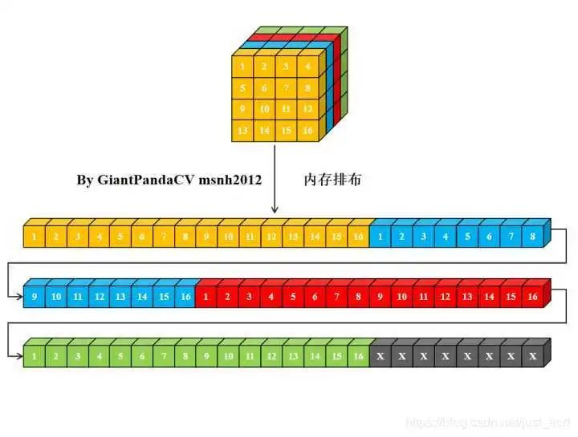
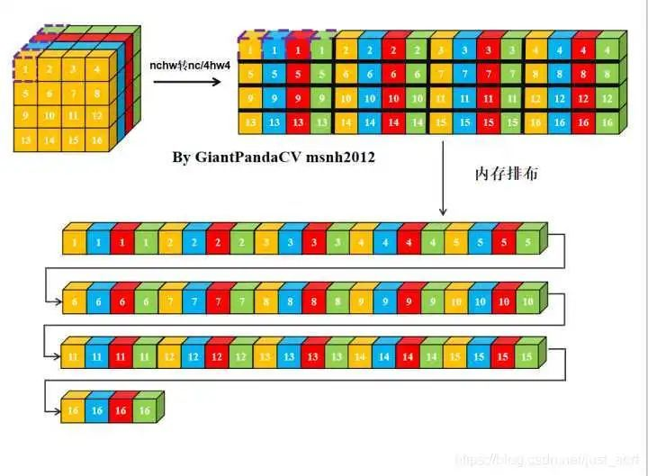
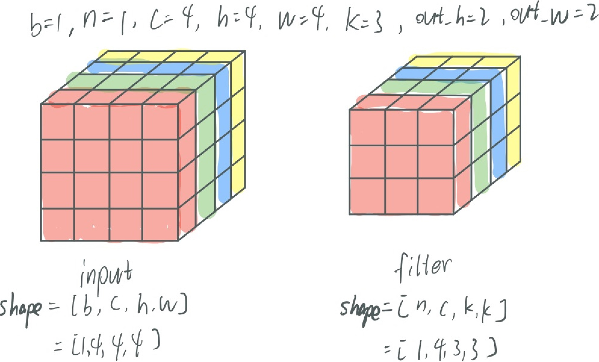
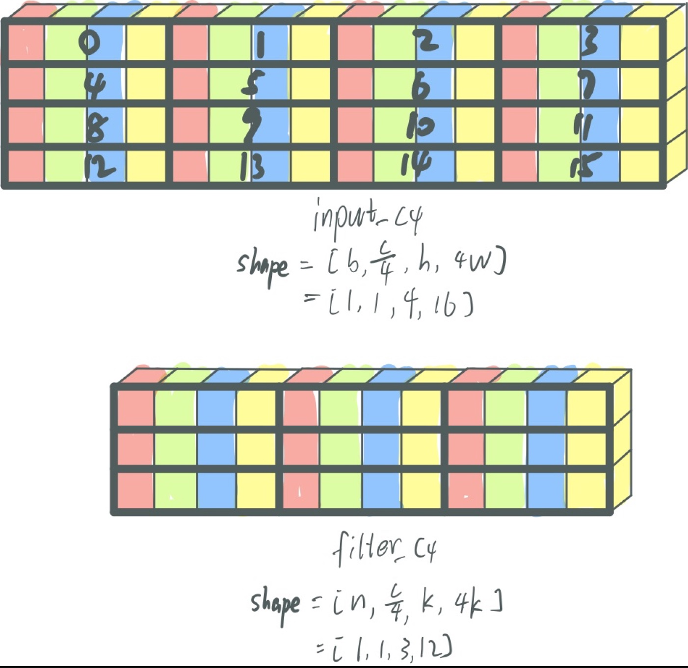
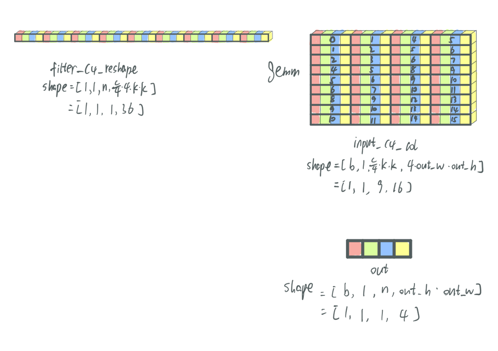
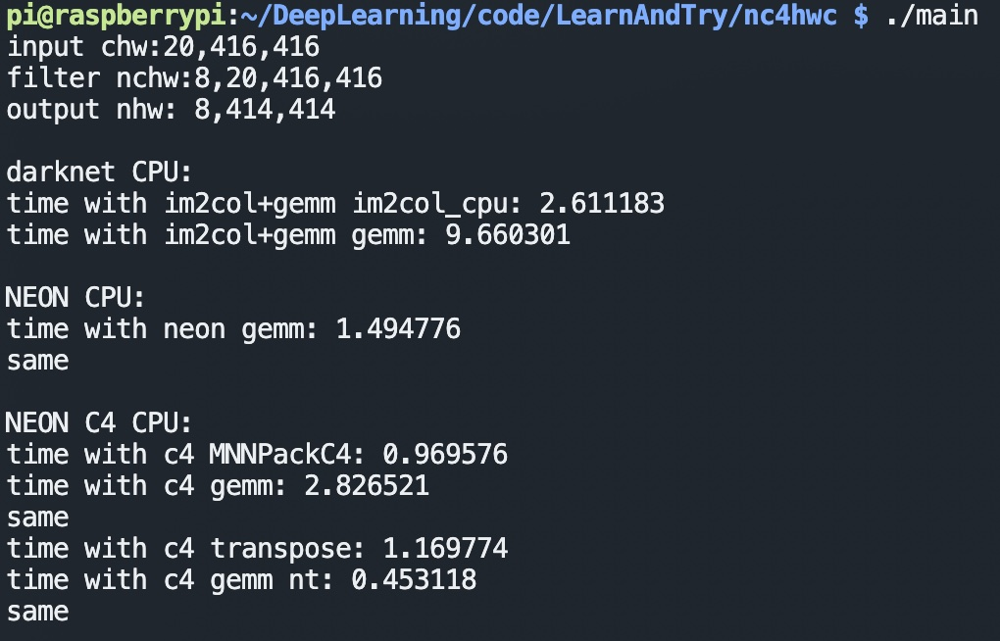

# nc4hw4排布配合neon加速im2col+gemm的卷积推理
## 一:前言
一个tensor常见的内存排布有nchw和nhwc,除此之外,MNN还有一种内存排布方式叫做nc4hw4,如何理解这个排布呢?这种排布对性能又有什么提升呢?
## 二:什么是nc4hw4

概念本身很简单,两幅图就很能说明.其实nc4hw4准确的说应该是n(c/4)h(w*4).一句话来说就是:沿着c方向取4个数按照w方向排列.如果c不是4的倍数,则全用0补上.
## 三:nc4hw4如何提升卷积推理性能
nc4hw4的出现就是为了配合矢量操作,如矢量读写,矢量乘累加,在arm上就是neon指令.由于在进行hw平面上的二维gemm时,不同c维度之间是互不影响的,正适合作为矢量操作的不同元素.nc4hw4排布配合neon加速im2col+gemm的卷积推理的具体过程如下:
+ 3.1.初始状态

所有的图在内存中的排列都是从左到右从上到下从前到后依次分布的.本文以filter对input进行卷积为例
+ 3.2.转成nc4hw4排布

我们看转换完成之后的input_c4和filter_c4,其实把每4个数看做一个单元(用加粗线表示),就和原本一样了.下面都会用到这个"单元"这个概念
+ 3.3.im2col

对input_c4以单元为单位进行im2col得到input_c4_col.忘记im2col过程的同学可以看[这篇文章](https://blog.csdn.net/Mrhiuser/article/details/52672824)回忆一下.然后对filter_c4只需要进行reshape以便后续gemm更直观
+ 3.4.gemm
input_c4_col的一列与filter_c4_reshape的一行进行对应单元相乘相加得到一个单元(和普通的矩阵乘法一样),然后将这个单元内的四个数自相加得到一个数就是最终的输出out的其中一个元素.这边input_c4_col我们取数是竖着取的,cache不友好,因此将input_c4_col以单元为单位转置一下得到input_c4_col_T,效果会更好
## 四:结果验证

在树莓派3B+上进行实验,在未进行如分块等其他gemm优化方法的情况下,nc4hw4配合neon的gemm速度相比于darknet的gemm提高为21倍,相比于非nc4hw4的neon(我[之前的文章](https://blog.csdn.net/hsqyc/article/details/108817807?spm=1001.2014.3001.5501)有介绍)速度也提高为3倍.本实验只关注gemm的效率,对于其他诸如转置等操作都没有优化.[实验代码](https://github.com/HuangShiqing/LearnAndTry/tree/main/nc4hw4)已上传,感兴趣的小伙伴可以去试一下,只需要改一下编译脚本mk.sh
里的架构参数即可. 别忘记star一下
## 五:思考
+ 5.1. 在卷积计算中,一次操作4个数的矢量操作,拿来用在4个不同通道的数是最完美的.  
+ 5.2. nc4hw4在计算的时候是会带来效率提升,但是也有代价,就是需要额外进行内存排布的转换,除非整个网络所有Op的推理实现都是以nc4hw4排布,这也是MNN所做的.只有中间遇到不支持nc4hw4排布的Op时会在该Op前后加入排布转换操作
## 参考链接
[参考链接1](https://cloud.tencent.com/developer/article/1748441)