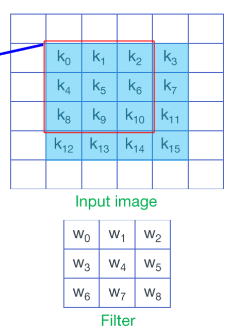

# 三种思路实现Winograd卷积, 配上代码的保姆级教程

## 前言

一般我们实现卷积的时候大多采用的方案是im2col+gemm, 除此之外, 还有一种加速方案, 就是Winograd卷积, 目前几乎在所有推理框架里都能找到其实现. Winograd卷积出自一篇2016CVPR[论文](https://arxiv.org/pdf/1509.09308.pdf). 网上相关的博客挺多的, 但是都几乎只是几个公式配几个图, 看完后似懂非懂, 没有对应代码总是会感觉少了点什么, 想去看各个推理框架的代码吧, 又对应不上, 看不懂. 本人经过一段时间的硬啃, 最终实现了Winograd多个思路的代码. 这个过程也让本人对Winograd的理解逐步加深. 写这篇博客记录和分享这个过程, 希望能让后来者学Winograd的过程中少走一些弯路.

## 一维基础知识

一般教程都从下面这样一个例子起手. 一个最简单的矩阵乘法(注意, 左边的矩阵是有特点的, 第一行的末尾两个数和二行开头两个数是一样的, 都是$d_1$, $d_2$):
$$
\left[
\begin{matrix}
d_0 & d_1 & d_2 \\
d_1 & d_2 & d_3 \\
\end{matrix}
\right]
\left[
\begin{matrix}
g_0 \\
g_1 \\
g_2 \\
\end{matrix}
\right]
=
\left[
\begin{matrix}
d_0*g_0+d_1*g_1+d_2*g_2 \\
d_1*g_0+d_2*g_1+d_3*g_2 \\
\end{matrix}
\right] \tag{1}
$$
按照公式(1)直接进行矩阵乘法总共包含6次乘法和4次加法. 

我们可以不直接计算, 而是用Winograd方法的$F(2,3)$计算, 两步走, 先计算以下4个数:
$$
m_1=(d_0-d_2)g_0 \qquad  m_2=(d_1+d_2)\frac{g_0+g_1+g_2}{2}\\
m_4=(d_1-d_3)g_2 \qquad m_3=(d_2-d_1)\frac{g_0-g_1+g_2}{2}\\ \tag{2}
$$
然后再计算:
$$
\left[
\begin{matrix}
d_0 & d_1 & d_2 \\
d_1 & d_2 & d_3 \\
\end{matrix}
\right]
\left[
\begin{matrix}
g_0 \\
g_1 \\
g_2 \\
\end{matrix}
\right]
=\left[
\begin{matrix}
m_1+m_2+m_3 \\
m_2-m_3-m_4 \\
\end{matrix}
\right] \tag{3}
$$
运算量包括:

+ 公式(2)中与$g$相关的4次加减操作和2次除法
+ 公式(2)中与$d$相关的4次加减法和$d$与$g$之间的4次乘法
+ 公式(3)中的4次加减法

在卷积计算中由于$d$是卷积核, 我们可以在推理前提前计算好, 因此总共只要4次乘法和8次加减法. 我们知道乘法操作是要比加法操作耗时更多的, 因此Winograd的4次乘法和8次加法是要比直接矩阵乘的6次乘法和4次加法快的, **Winograd的核心思想就是通过增加加法操作来减少乘法操作从而实现计算加速**


然后你会被告知, 上述操作可以写成矩阵形式:
$$
Y=A^T[(Gg)⊙(B^Td)] \tag{4}
$$
其中$⊙$为对应位置相乘, 其余都是矩阵乘. 几个$A^T$, $B^T$, $G^T$都是已知的
$$
A^T=
\left[
\begin{matrix}
1 & 1 & 1 & 0\\
0 & 1 & -1 & -1 \\
\end{matrix}
\right]

\qquad

B^T =
\left[
\begin{matrix}
1 & 0 & -1 & 0\\
0 & 1 & 1 & 0 \\
0 & -1 & 1 & 0 \\
0 & 1 & 0 & -1 \\
\end{matrix}
\right]

\qquad

G =
\left[
\begin{matrix}
1 & 0 & 0\\
\frac{1}{2} & \frac{1}{2} & \frac{1}{2} \\
\frac{1}{2} & -\frac{1}{2} & \frac{1}{2} \\
0 & 0 & 1 \\
\end{matrix}
\right] \tag{5}
$$

$$
g=
\left[
\begin{matrix}
g_0\\
g_1\\
g_2\\
\end{matrix}
\right]

\qquad

d=
\left[
\begin{matrix}
d_0\\
d_1\\
d_2\\
d_3\\
\end{matrix}
\right]
$$

怎么把公式(2)公式(3)推导转换成公式(4)的矩阵形式咱们不关心, 反正这个公式(4)就是最终一维Winograd的结论公式呗. 这里我们发现其实Winograd有两种结论公式可以套用计算. 为了后文方便说明, 我们人为定义公式(2)公式(3)叫做**"Winograd的结论公式1"**,  公式(4)叫做**"Winograd的结论公式2"**

## 二维winograd卷积思路一: 直接使用结论公式2

对于一个卷积, 输入input尺寸是4x4, 卷积核为3x3, stride为1, 我相信你看着下图能够很熟练的脑补出卷积过程:



<center>图1.卷积示意图</center>

正常卷积需要进行36次乘法和32次加法

然后我们用二维Winograd的结论公式2来算
$$
Y=A^T[(GgG^T)⊙(B^TdB)]A =A^T[U⊙V]A \tag{6}
$$

其中4x4的矩阵$d$对应4x4的卷积输入, 3x3的矩阵$g$对应3x3的卷积核. 其余几个矩阵$A^T$, $B^T$, $G^T$, $A$, $B$, $G$都是固定已知的:
$$
A=
\left[
\begin{matrix}
1 & 0\\
1 & 1\\
1 & -1\\
0 & -1\\
\end{matrix}
\right]

\qquad

A^T=
\left[
\begin{matrix}
1 & 1 & 1 & 0\\
0 & 1 & -1 & -1 \\
\end{matrix}
\right]
$$

$$
B =
\left[
\begin{matrix}
1 & 0 & 0 & 0\\
0 & 1 & -1 & 1 \\
-1 & 1 & 1 & 0 \\
0 & 0 & 0 & -1 \\
\end{matrix}
\right]

\qquad

B^T =
\left[
\begin{matrix}
1 & 0 & -1 & 0\\
0 & 1 & 1 & 0 \\
0 & -1 & 1 & 0 \\
0 & 1 & 0 & -1 \\
\end{matrix}
\right]
$$

$$
G =
\left[
\begin{matrix}
1 & 0 & 0\\
\frac{1}{2} & \frac{1}{2} & \frac{1}{2} \\
\frac{1}{2} & -\frac{1}{2} & \frac{1}{2} \\
0 & 0 & 1 \\
\end{matrix}
\right]

\qquad

G^T =
\left[
\begin{matrix}
1 & \frac{1}{2} & \frac{1}{2} & 0\\
0 & \frac{1}{2} & -\frac{1}{2} & 0 \\
0 & \frac{1}{2} & \frac{1}{2} & 1 \\
\end{matrix}
\right]
$$

$$
g=
\left[
\begin{matrix}
w_0 & w_1 & w_2\\
w_3 & w_4 & w_5\\
w_6 & w_7 & w_8\\
\end{matrix}
\right]

\qquad

d=
\left[
\begin{matrix}
k_0 & k_1 & k_2 & k_3\\
k_4 & k_5 & k_6 & k_7\\
k_8 & k_9 & k_{10} & k_{11}\\
k_{12} & k_{13} & k_{14} & k_{15}\\
\end{matrix}
\right]
$$

那么用代码来实现这个二维Winograd就很简单. 只要实现矩阵乘法dot和对应点相乘multi这两个函数即可

```c
// 思路一: 直接使用结论公式2
float A[8] = {1, 0, 
              1, 1, 
              1, -1,
              0, -1};
float AT[8] = {1, 1, 1, 0,
               0, 1, -1, -1};
float B[16] = {1, 0, 0, 0, 
               0, 1, -1, 1,
               -1, 1, 1, 0,
               0, 0, 0, -1};
float BT[16] = {1, 0, -1, 0,
                0, 1, 1, 0,
                0, -1, 1, 0,
                0, 1, 0, -1};
float G[12] = {1, 0, 0,
               0.5, 0.5, 0.5,
               0.5, -0.5, 0.5,
               0, 0, 1};
float GT[12] = {1, 0.5, 0.5, 0,
                0, 0.5, -0.5, 0,
                0, 0.5, 0.5, 1};
//矩阵乘
void dot(float* A, int row_A, int col_A, float* B, int row_B, int col_B, float* C) {
    assert(col_A == row_B);              // && row_A == col_B
                                         //由矩阵相乘，要求f2=s1，以下用f2
    for (int i = 0; i < row_A; i++)      // i表示第i行
        for (int j = 0; j < col_B; j++)  // j表示第j列
            //  C[i*col_A + j] = 0;        //在这里 result[i][j] = result[i*f2+j];
            for (int p = 0; p < col_A; p++)
                C[i * col_B + j] += A[i * col_A + p] * B[p * col_B + j];
}
//对应点相乘
void multi(float* A, int row_A, int col_A, float* B, int row_B, int col_B, float* C) {
    assert(row_A == row_B && col_A == col_B);
    for (int i = 0; i < row_A; i++)
        for (int j = 0; j < col_A; j++)
            C[col_A * i + j] = A[col_A * i + j] * B[col_A * i + j];
}

void winograd(float* g, float* d, float* result) {
    float Gg[12] = {0};
    float U[16] = {0};
    float BTd[16] = {0};
    float V[16] = {0};
    float UV[16] = {0};
    float ATUV[8] = {0};
    
    dot(G, 4, 3, g, 3, 3, Gg);
    dot(Gg, 4, 3, GT, 3, 4, U);
    dot(BT, 4, 4, d, 4, 4, BTd);
    dot(BTd, 4, 4, B, 4, 4, V);
    multi(U, 4, 4, V, 4, 4, UV);
    dot(AT, 2, 4, UV, 4, 4, ATUV);
    dot(ATUV, 2, 4, A, 4, 2, result);
}

int main(int argc, char const *argv[]){
    float g[] = {1, 2, 3, 
                 4, 5, 6,
                 7, 8, 9};
    float d[] = {1,2,3,4,
                 5,6,7,8,
                 9,10,11,12,
                 13,14,15,16};
    float result[4]={0};
    winograd(g, d, result);
    return 0;
}
```

但是突然, 我发现好像有哪里不对啊, 用这个结论公式2计算的过程好像计算量更大了:

+ Gg的计算需要36次乘法和24次加法
+ U=GgGT的计算需要48次乘法和32次加法
+ BTd的计算需要64次乘法和48次加法
+ V=BTdB的计算需要64次乘法和48次加法
+ U$⊙$V的计算需要16次乘法
+ AT(U$⊙$V)的计算需要32次乘法和24次加法
+ AT(U$⊙$V)A的计算需要16次乘法和12次加法

总计需要276次乘法和188次加法, 即使我把g相关的矩阵乘法先计算好, 那剩下的还是要比原来直接计算所需的36次乘法多的多啊


## 思路二: 嵌套使用两次结论公式1

看样子直接套结论公式2是不对的, 而且看起来还有点蠢. 难道说我们应该套用的是结论公式1么? 但是二维的结论公式1又应该怎么操作呢? 于是我又看了看之前是不是看漏掉点什么, 发现确实跳过了一些东西, 我们接下来看看下面这个一维Winograd到二维Winograd的推广过程:


<center>图2.卷积输入和卷积核的转换</center>


<center>图3.卷积输入和卷积核的划块</center>


<center>图4.外层Winograd的计算</center>

$$
(K_0-K_2)W_0=
\left[
\begin{matrix}
k_0-k_8 & k_1-k_9 & k_2-k_{10}\\
k_1-k_9 & k_2-k{10} & k_3-k_{11}\\
\end{matrix}
\right]
\left[
\begin{matrix}
w_0\\
w_1\\
w_2\\
\end{matrix}
\right]
=
\left[
\begin{matrix}
r_0\\
r_1\\
\end{matrix}
\right]
=
\left[
\begin{matrix}
m_0+m_1+m_2\\
m_1-m_2-m_3\\
\end{matrix}
\right]
\\
m_0=((k_0-k_8)-(k_2-k_{10}))w_0 \qquad m_1=((k_1-k_9)+(k_2-k_{10}))\frac{w_0+w_1+w_2}{2}\\
m_3=((k_1-k_9)-(k_3-k_{11})) w_2 \qquad m_2=((k_2-k_{10})-(k_1-k_9))\frac{w_0-w_1+w_2}{2}\\
$$

<center>图5.内层Winograd的计算</center>

图2是把4x4的输入经过一个[im2col](https://blog.csdn.net/Mrhiuser/article/details/52672824)的操作变成一个4x9的矩阵(im2col的操作一言以蔽之就是卷积核滑动过的4个3x3区域拉平放一起), 这样就可以将卷积过程变成矩阵乘gemm. 得到的4x1的输出矩阵对应原本卷积输出的左上, 右上, 左下, 右下四个数. 上述过程其实就是常见的im2col+gemm的卷积实现方案, 需要36次乘法和32次加法. 按照二维Winograd的方法, 我们将这两个矩阵按照图2中红线所示划分成"大块"得到图3所示. 哎, 是不是看出点什么了, 以"大块"为单位的话, 这他娘的不就是符合最开始讲的一维Winograd卷积的输入形式了嘛, 只需要注意"块"与"块"之间的乘法是矩阵乘即可. 然后你会发现, 计算"大块"结果$R_0$需要先计算出"大块"$M_0$, 计算"大块"$M_0$又需要先计算"大块"$(K_0-K_2)W_0$, 哎, 仔细一看, 这个"大块"$(K_0-K_2)W_0$他娘的又是符合一维Winograd的输入形式的. 我悟了呀, **原来二维Winograd的实现就是嵌套了两层一维Winograd**. 这样的话, 不考虑与$W$相关的可以提前计算的部分, 其余总的计算量只需要16次乘法和44次加法, 理论上确实是要比直接矩阵乘的36次乘法和32次加法要快的. 也就是说实现二维Winograd卷积的时候, 应该嵌套计算一维Winograd的结论公式1. 结论公式2就是骗鬼的吧.


于是实现起来就不难了呀, 整体流程分为:

+ 对卷积核w的处理transforme_g

+ 对输入的处理im2col

+ 进行两次嵌套的结论公式1的计算

 这里卷积核的处理transforme_g, 由于需要提前进行连续两次计算下面公式所述的转化计算, 我怕大家看不懂, 画了下面这张图, 结合代码winograd3_transforme_g应该可以看得懂. 
$$
g_0 \qquad \frac{g_0+g_1+g_2}{2} \\  
g_2 \qquad \frac{g_0-g_1+g_2}{2} \\
$$


<center>图6.卷积核的两层转换计算</center>

至于输入的im2col处理, 可以看图7. 其中红色箭头表示内存排布的先后顺序, 配合代码winograd3_im2col


<center>图7.输入的im2col处理</center>

```c
//思路二: 嵌套使用两次结论公式1
void winograd3_transforme_g(float* g, float* transformed_g) {
    *(transformed_g++) = *g;
    *(transformed_g++) = (*g + *(g + 1) + *(g + 2)) * 0.5;
    *(transformed_g++) = (*g - *(g + 1) + *(g + 2)) * 0.5;
    *(transformed_g++) = *(g + 2);

    *(transformed_g++) = (*g + *(g + 3) + *(g + 6)) * 0.5;
    *(transformed_g++) = (*g + *(g + 3) + *(g + 6) + *(g + 1) + *(g + 4) + *(g + 7) + *(g + 2) + *(g + 5) + *(g + 8)) * 0.25;
    *(transformed_g++) = (*g + *(g + 3) + *(g + 6) - *(g + 1) - *(g + 4) - *(g + 7) + *(g + 2) + *(g + 5) + *(g + 8)) * 0.25;
    *(transformed_g++) = (*(g + 2) + *(g + 5) + *(g + 8)) * 0.5;

    *(transformed_g++) = (*g - *(g + 3) + *(g + 6)) * 0.5;
    *(transformed_g++) = (*g - *(g + 3) + *(g + 6) + *(g + 1) - *(g + 4) + *(g + 7) + *(g + 2) - *(g + 5) + *(g + 8)) * 0.25;
    *(transformed_g++) = (*g - *(g + 3) + *(g + 6) - *(g + 1) + *(g + 4) - *(g + 7) + *(g + 2) - *(g + 5) + *(g + 8)) * 0.25;
    *(transformed_g++) = (*(g + 2) - *(g + 5) + *(g + 8)) * 0.5;

    *(transformed_g++) = *(g + 6);
    *(transformed_g++) = (*(g + 6) + *(g + 7) + *(g + 8)) * 0.5;
    *(transformed_g++) = (*(g + 6) - *(g + 7) + *(g + 8)) * 0.5;
    *(transformed_g++) = *(g + 8);
}

void winograd3_im2col(float* data_im, float* data_col) {
    int width_stride = 4;
    float* dst = data_col;
    float* src = data_im;
	
    //K0
    *(dst++) = *src;        // k0
    *(dst++) = *(src + 1);  // k1
    *(dst++) = *(src + 2);  // k2
    *(dst++) = *(src + 1);  // k1
    *(dst++) = *(src + 2);  // k2
    *(dst++) = *(src + 3);  // k3
	//K1
    *(dst++) = *(src + width_stride);      // k4
    *(dst++) = *(src + width_stride + 1);  // k5
    *(dst++) = *(src + width_stride + 2);  // k6
    *(dst++) = *(src + width_stride + 1);  // k5
    *(dst++) = *(src + width_stride + 2);  // k6
    *(dst++) = *(src + width_stride + 3);  // k7
	//K2
    *(dst++) = *(src + 2 * width_stride);      // k8
    *(dst++) = *(src + 2 * width_stride + 1);  // k9
    *(dst++) = *(src + 2 * width_stride + 2);  // k10
    *(dst++) = *(src + 2 * width_stride + 1);  // k9
    *(dst++) = *(src + 2 * width_stride + 2);  // k10
    *(dst++) = *(src + 2 * width_stride + 3);  // k11
	//K1
    *(dst++) = *(src + width_stride);      // k4
    *(dst++) = *(src + width_stride + 1);  // k5
    *(dst++) = *(src + width_stride + 2);  // k6
    *(dst++) = *(src + width_stride + 1);  // k5
    *(dst++) = *(src + width_stride + 2);  // k6
    *(dst++) = *(src + width_stride + 3);  // k7
	//K2
    *(dst++) = *(src + 2 * width_stride);      // k8
    *(dst++) = *(src + 2 * width_stride + 1);  // k9
    *(dst++) = *(src + 2 * width_stride + 2);  // k10
    *(dst++) = *(src + 2 * width_stride + 1);  // k9
    *(dst++) = *(src + 2 * width_stride + 2);  // k10
    *(dst++) = *(src + 2 * width_stride + 3);  // k11
	//K3
    *(dst++) = *(src + 3 * width_stride);      // k12
    *(dst++) = *(src + 3 * width_stride + 1);  // k13
    *(dst++) = *(src + 3 * width_stride + 2);  // k14
    *(dst++) = *(src + 3 * width_stride + 1);  // k13
    *(dst++) = *(src + 3 * width_stride + 2);  // k14
    *(dst++) = *(src + 3 * width_stride + 3);  // k15
}

void winograd3_1d(float* d, float* transformed_g, float* m) {
    float m1 = (d[0] - d[2]) * transformed_g[0];
    float m2 = (d[1] + d[2]) * transformed_g[1];
    float m3 = (d[2] - d[1]) * transformed_g[2];
    float m4 = (d[1] - d[5]) * transformed_g[3];
    m[0] = m1 + m2 + m3;
    m[1] = m2 - m3 - m4;
}

void K_add_K(float* k, float* dst, int index1, int index2) {
    float* k1 = k + 6 * index1;
    float* k2 = k + 6 * index2;
    for (int i = 0; i < 6; i++)
        *dst++ = *(k1++) + *(k2++);
}

void K_sub_K(float* k, float* dst, int index1, int index2) {
    float* k1 = k + 6 * index1;
    float* k2 = k + 6 * index2;
    for (int i = 0; i < 6; i++)
        *dst++ = *(k1++) - *(k2++);
}

void winograd3_2d(float* transformed_k, float* transformed_g, float* R) {
    // float R[4]={0};
    // float R0[2] = {0};
    // float R1[2] = {0};

    float M0[2] = {0};
    float M1[2] = {0};
    float M2[2] = {0};
    float M3[2] = {0};
    float K0subK2[6] = {0};
    float K1subK3[6] = {0};
    float K1addK2[6] = {0};
    float K2subK1[6] = {0};

    K_sub_K(transformed_k, K0subK2, 0, 2);
    K_sub_K(transformed_k, K1subK3, 1, 5);  // k3是在5
    K_add_K(transformed_k, K1addK2, 1, 2);
    K_sub_K(transformed_k, K2subK1, 2, 1);

    winograd3_1d(K0subK2, transformed_g, M0);
    winograd3_1d(K1addK2, transformed_g + 4, M1);
    winograd3_1d(K2subK1, transformed_g + 8, M2);
    winograd3_1d(K1subK3, transformed_g + 12, M3);

    for (int i = 0; i < 2; i++)
        R[i] += M0[i] + M1[i] + M2[i];  //可以累加
    for (int i = 0; i < 2; i++)
        R[2 + i] += M1[i] - M2[i] - M3[i];  //可以累加
}

int main(int argc, char const* argv[]) {
    float g[] = {1, 2, 3, 
                 4, 5, 6, 
                 7, 8, 9};
    float d[] = {1, 2, 3, 4, 
                 5, 6, 7, 8,
                 9, 10, 11, 12,
                 13, 14, 15, 16};
    float result[4] = {0};
    
    float* transformed_g = calloc(16, sizeof(float));
    winograd3_transforme_g(g, transformed_g);

    float* transformed_d = calloc(16, sizeof(float));
    winograd3_im2col(d, transformed_d);

    winograd3_2d(transformed_g, transformed_d, result);
    return 0;
}
```

## 思路三: 结论公式2与固定已知系数的加法

本以为实现了思路二就领悟到了Winograd的真谛, 于是去读了读ncnn的实现, 发现, 嗯, 好像又不太一样. 除去一系列内存重排的部分, ncnn实现Winograd计算部分的思路其实是也是套用结论公式2的, 但是计算的时候又不是矩阵乘而是固定系数的. 其实本质就是结合了前面的思路一的直接套用结论公式2与思路二的transforme_g操作. 比如在计算$B^Td$的时候, **由于$B^T$里有很多0和正负1, 其实我是可以不用乘的. 固定死写成加法即可**, 这样原本所需要的64次乘法我全部都可以省掉了, 加法也从48次变成32次. 
$$
1*k_0+0*k_4+(-1)*k_8+0*k_{12}=k_0 - k_8
\\

B^Td =
\left[
\begin{matrix}
1 & 0 & -1 & 0\\
0 & 1 & 1 & 0 \\
0 & -1 & 1 & 0 \\
0 & 1 & 0 & -1 \\
\end{matrix}
\right]

\left[
\begin{matrix}
k_0 & k_1 & k_2 & k_3\\
k_4 & k_5 & k_6 & k_7\\
k_8 & k_9 & k_{10} & k_{11}\\
k_{12} & k_{13} & k_{14} & k_{15}\\
\end{matrix}
\right]


=\left[
\begin{matrix}
k_0 - k_8 & k_1 - k_9 & k_2 - k_{10} & k_3 - k_{11} \\
k_4 + k_8 & k_5 + k_9 & k_6 + k_{10} & k_7 + k_{11} \\
-k_4 + k_8 & -k_5 + k_9 & -k_6 + k_{10} & -k_7 + k_{11} & \\
k_4 - k_{12} & k_5 - k_{13} & k_6 - k_{14} & k_7 - k_{15} &\\
\end{matrix}
\right] \tag{7}
$$
这真是太妙了, 我怎么就没有想到呢. 也就是说, **Winograd的结论公式2只是用于描述计算的流程, 具体计算用的是固定已知系数的加法**.


```c
// 思路三: 结论公式2与固定已知系数的加法
float G[12] = {1, 0, 0,
               0.5, 0.5, 0.5,
               0.5, -0.5, 0.5,
               0, 0, 1};
float GT[12] = {1, 0.5, 0.5, 0,
                0, 0.5, -0.5, 0,
                0, 0.5, 0.5, 1};
//矩阵乘
void dot(float* A, int row_A, int col_A, float* B, int row_B, int col_B, float* C) {
    assert(col_A == row_B);              // && row_A == col_B
                                         //由矩阵相乘，要求f2=s1，以下用f2
    for (int i = 0; i < row_A; i++)      // i表示第i行
        for (int j = 0; j < col_B; j++)  // j表示第j列
            //  C[i*col_A + j] = 0;        //在这里 result[i][j] = result[i*f2+j];
            for (int p = 0; p < col_A; p++)
                C[i * col_B + j] += A[i * col_A + p] * B[p * col_B + j];
}
//对应点相乘
void multi(float* A, int row_A, int col_A, float* B, int row_B, int col_B, float* C) {
    assert(row_A == row_B && col_A == col_B);
    for (int i = 0; i < row_A; i++)
        for (int j = 0; j < col_A; j++)
            C[col_A * i + j] = A[col_A * i + j] * B[col_A * i + j];
}

void winograd6_transforme_g(float* g, float* transformed_g) {
    float Gg[12] = {0};

    dot(G, 4, 3, g, 3, 3, Gg);  //先计算得到U=GgGT
    dot(Gg, 4, 3, GT, 3, 4, transformed_g);
}

void winograd6(float* U, float* d, float* result) {
    float BTd[16] = {0};
    float V[16] = {0};
    float UV[16] = {0};
    float ATUV[8] = {0};

    // start dot(BT, 4, 4, d, 4, 4, BTd);
    BTd[0] = d[0] - d[8];
    BTd[1] = d[1] - d[9];
    BTd[2] = d[2] - d[10];
    BTd[3] = d[3] - d[11];

    BTd[4] = d[4] + d[8];
    BTd[5] = d[5] + d[9];
    BTd[6] = d[6] + d[10];
    BTd[7] = d[7] + d[11];

    BTd[8] = -d[4] + d[8];
    BTd[9] = -d[5] + d[9];
    BTd[10] = -d[6] + d[10];
    BTd[11] = -d[7] + d[11];

    BTd[12] = d[4] - d[12];
    BTd[13] = d[5] - d[13];
    BTd[14] = d[6] - d[14];
    BTd[15] = d[7] - d[15];
    // end dot(BT, 4, 4, d, 4, 4, BTd);

    // start dot(BTd, 4, 4, B, 4, 4, V);
    V[0] = BTd[0] - BTd[2];
    V[4] = BTd[4] - BTd[6];
    V[8] = BTd[8] - BTd[10];
    V[12] = BTd[12] - BTd[14];

    V[1] = BTd[1] + BTd[2];
    V[5] = BTd[5] + BTd[6];
    V[9] = BTd[9] + BTd[10];
    V[13] = BTd[13] + BTd[14];

    V[2] = -BTd[1] + BTd[2];
    V[6] = -BTd[5] + BTd[6];
    V[10] = -BTd[9] + BTd[10];
    V[14] = -BTd[13] + BTd[14];

    V[3] = BTd[1] - BTd[3];
    V[7] = BTd[5] - BTd[7];
    V[11] = BTd[9] - BTd[11];
    V[15] = BTd[13] - BTd[15];
    // end dot(BTd, 4, 4, B, 4, 4, V);

    multi(U, 4, 4, V, 4, 4, UV);

    // start dot(AT, 2, 4, UV, 4, 4, ATUV);
    ATUV[0] = UV[0] + UV[4] + UV[8];
    ATUV[1] = UV[1] + UV[5] + UV[9];
    ATUV[2] = UV[2] + UV[6] + UV[10];
    ATUV[3] = UV[3] + UV[7] + UV[11];
    
    ATUV[4] = UV[4] - UV[8] - UV[12];
    ATUV[5] = UV[5] - UV[9] - UV[13];
    ATUV[6] = UV[6] - UV[10] - UV[14];
    ATUV[7] = UV[7] - UV[11] - UV[15];
    // end dot(AT, 2, 4, UV, 4, 4, ATUV);

    // start dot(ATUV, 2, 4, A, 4, 2, result);
    result[0] += (ATUV[0] + ATUV[1] + ATUV[2]);
    result[2] += (ATUV[4] + ATUV[5] + ATUV[6]);
    result[1] += (ATUV[1] - ATUV[2] - ATUV[3]);
    result[3] += (ATUV[5] - ATUV[6] - ATUV[7]);
    // end dot(ATUV, 2, 4, A, 4, 2, result);
}

int main(int argc, char const* argv[]) {
    float g[] = {1, 2, 3, 
                 4, 5, 6, 
                 7, 8, 9};
    float d[] = {1, 2, 3, 4, 
                 5, 6, 7, 8, 
                 9, 10, 11, 12, 
                 13, 14, 15, 16};
    float result[4] = {0};

    float* transformed_g = calloc(16, sizeof(float));
    winograd6_transforme_g(g, transformed_g);

    winograd6(transformed_g, d, result);
    return 0;
}
```

整个流程需要16次乘法和92次加法. 不得不说, 这个思路三要比思路二更加直接简洁, 速度也更快. 关于为什么理论计算量思路三与思路二相比乘法数量一样加法数量多一些, 但是速度要更快可能一个是因为我写的代码不够高效, 另一个可能是因为思路三流程更加直接, 编译器优化效果更好. 此时, 我对这个Winograd的公式使用才有一个比较深刻的认识. 思路一觉得可以直接套用结论公式2进行加速, 发现矩阵乘的计算量更大了, 这属于第一层, 看山是山. 思路二觉得我可以嵌套了两层一维Winograd的结论公式1进行加速, 理论计算量少了速度也确实也快了, 但是两层一维实现起来不够优雅直接, 同时没有用到结论公式2. 这属于第二层, 看山不是山.  思路三将结论公式2用于描述计算的流程, 具体计算用的是固定已知系数的加法. 整体直接简洁. 这属于第三层, 看山还是山. 各个开源框架实现的都是用的思路三.


## 大尺寸矩阵输入

此时我们需要来讲一讲Winograd的几个字母表示的含义. 上面我们一直讲的都是Winograd的$F(2, 3)$, 这里2对应的是$m$, 代表输出的尺寸为2x2, 3对应的是$r$, 代表卷积核的尺寸为3x3. 我们的输入尺寸为4x4, 叫做tile块, 用$m+r-1$来表示tile的尺寸. 如果我们输入是更大的比如[8, 8]应该如何处理呢? 答案就是切块, 把输入切成多个tile块, 每个tile都单独进行上述的计算即可. 在切块的时候我们需要注意相邻tile是有重叠的, 重叠的大小为$r-1$. 示意图如下:


<center>图8.tile的划分</center>

对于大尺寸的输入, 实现的代码就不贴出来了, 感兴趣的小伙伴可以去[我的Github](https://github.com/HuangShiqing/LearnAndTry/tree/main/winograd)上clone下来自己玩玩. 

## Winograd卷积的一些使用准则
1. 卷积的stride等于2时加速收益不高
2. 深度可分离卷积用Winograd不划算
3. Winograd卷积由于一些系数是是除不尽的, 所以有一定的精度损失
4. tile块越大, 加速效果越好

## 总结

本文的核心就是实现Winograd卷积的三个思路. 思路一, 直接使用结论公式2. 思路二, 嵌套使用两次结论公式1. 思路三, 结论公式2与固定已知系数的加法. 本文的代码都是为了说明算法实现问题, 优化点只在于用Winograd减小了计算量, 应该还有挺多改进空间的, 比如访存效率等.  

## 参考

1. [计算获得各个参数A, B, G](https://github.com/andravin/wincnn), 但是这个多项式系数polynomial interpolation points怎么指定我没搞懂. [这个论文](https://openreview.net/forum?id=H1ZaRZVKg&noteId=H1ZaRZVKg)讲了怎么指定, 但是我没仔细看
2.  [比较好的博客, 本文挺多图来源于该博客](https://www.cnblogs.com/shine-lee/p/10906535.html)
3. [论文原文](https://arxiv.org/pdf/1509.09308.pdf)
4. [原版论文](http://openaccess.thecvf.com/content_cvpr_2016/papers/Lavin_Fast_Algorithms_for_CVPR_2016_paper.pdf)
5. [后人论文](https://arxiv.org/pdf/1810.01973.pdf)
6. [参考](https://freshmou.github.io/2018/05/winograd/)
7. [参考](https://www.cnblogs.com/shine-lee/p/10906535.html#%E5%8D%B7%E7%A7%AF%E7%A5%9E%E7%BB%8F%E7%BD%91%E7%BB%9C%E4%B8%AD%E7%9A%84winograd)
8. [参考](https://hey-yahei.cn/2019/08/21/winograd_convolution/index.html)
9. [intel的Winograd的视频教程](https://aijishu.com/l/1110000000021582)
10. [别人的讨论](https://github.com/soumith/convnet-benchmarks/issues/93)
11. [High-Performance Matrix Multiplication](https://gist.github.com/nadavrot/5b35d44e8ba3dd718e595e40184d03f0)


