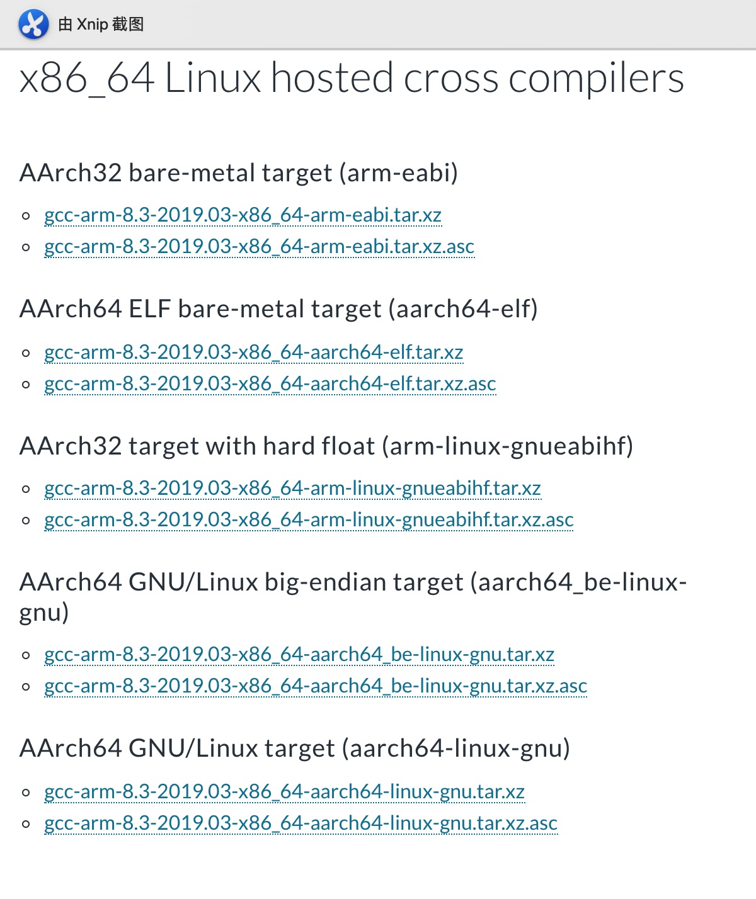

# 什么是交叉编译器
### 交叉编译器可以使我们在主机上编译出可以在嵌入式设备上运行的程序

# 下载地址
- ## arm官方提供的下载地址在这：链接 [link](https://developer.arm.com/tools-and-software/open-source-software/developer-tools/gnu-toolchain/gnu-a/downloads)

- ## ubuntu直接apt-get下载
  ```bash
  sudo apt-get install gcc-aarch64-linux-gnu#安装64位用于操作系统的交叉编译器，gcc版本是5.4，安装位置在/usr/bin  
  sudo apt-get install gcc-arm-linux-gnueabihf#安装32位用于操作系统的交叉编译器，gcc版本是5.4，安装位置在/usr/bin
  ```
# <font color=red>名字解释</font>
  有好多可选，接下来一一解释这么些都是些啥，这么长的名字都分别代表了什么含义。我们只对x86_64 linux系统主机中的几个交叉编译器进行名字分析，windows的不管
  - **[gcc]-[arm]-[8.3]-[2019.03]-[x86_64]-[arm]-[eabi].tar.xz**  
gcc就是我们用的gcc，arm代表嵌入式平台是arm，8.3代表gcc的版本，2019.03代表该交叉编译器的发布时间，x86_64代表主机的平台可以是32位系统也可以是64位系统，arm代表的是32位架构同时这个位置不带linux也代表了这个编译器是编译不带操作系统的裸机程序，eabi代表[嵌入式应用程序二进制接口](https://baike.baidu.com/item/EABI/732203?fr=aladdin)
  - **[gcc]-[arm]-[8.3]-[2019.03]-[x86_64]-[arm-linux]-[gnueabihf].tar.xz**   
与上面最大的不同是arm变成了arm-linux，代表该编译器是编译跟linux系统相关的，eabi变成了gnueabihf，其中gnueabi代表使用了GNU针对PC的Glibc库（因为这里是编译d操作系统的），其中hf代表浮点计算使用[hard float](https://www.cnblogs.com/xiaotlili/p/3306100.html)方法    
[armel、armhf和arm64的关系与区别](https://blog.csdn.net/harrypap/article/details/96874175)  

  - **[gcc]-[arm]-[8.3]-[2019.03]-[x86_64]-[aarch64]-[elf].tar.xz**  
aarch64代表目标板是armv8 64位架构不带操作系统,elf代表用嵌入式库uclib或newlib，同时64位的arm默认就是hf的，因此不需要hf的后缀    
 [elf和eabi区别](https://blog.csdn.net/mahongtu0204/article/details/17954895?depth_1-utm_source=distribute.pc_relevant.none-task&utm_source=distribute.pc_relevant.none-task)  
[elf和eabi区别](https://blog.csdn.net/mahongtu0204/article/details/17954895?depth_1-utm_source=distribute.pc_relevant.none-task&utm_source=distribute.pc_relevant.none-task)
  - **[gcc]-[arm]-[8.3]-[2019.03]-[x86_64]-[aarch64-linux]-[gnu].tar.xz**  
aarch64-linux代表armv8 64位架构的带linux操作系统的，gnu代表使用了GNU针对PC的Glibc库
  - **[gcc]-[arm]-[8.3]-[2019.03]-[x86_64]-[aarch64_be-linux]-[gnu].tar.xz**  
be代表大端，一般别的默认用小端
# 命名总结
||代表gcc编译器|代表目标芯片为arm|gcc的版本|该交叉编译工具发布时间|主机的平台可以是32位系统也可以是64位系统|目标芯片运行的架构和是否带操作系统|用什么库相关|
|:-----:| :-----:| :----: | :----: |:----: |:----: |:----: |:----: |
|32位裸机| gcc | arm | 8.3 |2019.03|x86_64|arm<br>（32位无操作系统的裸机）|eabi|
|32位带操作系统|  |  |  | ||arm-linux<br>（32位linux系统）|gnueabihf<br>（针对使用GNU针对PC的Glibc库，且是硬浮点）|
|64位裸机|  |  |  | ||aarch64<br>（64位无操作系统的裸机）|elf<br>（用嵌入式库uclib或newlib）|
|64位带操作系统|  |  |  | ||aarch64-linux<br>（64位linux系统）|-gnu<br>（用GNU针对PC的Glibc库，64位默认是硬浮点）|

# 使用方法
1. 下载解压到目录下，然后在~/.bashrc里将目录加入环境  
    ``` bash
    export PATH=/home/hsq/gcc-arm-8.3-2019.03-x86_64-aarch64-linux-gnu/bin:$PATH#该目录下的aarch64-linux-gnu-gcc才是真正代替gcc进行编译的本体  
    export CROSS_COMPILE=aarch64-linux-gnu-#用于指定交叉编译，在大部分项目的makefile文件中该参数会加在gcc前面
    export ARCH=arm64#用于大部分项目指定目标架构，包括后续涉及的uboot、linux原码等项目
    ```
2. 查看
    ```bash
    aarch64-linux-gnu-gcc --version#打印出版本信息
    ```
3. 然后编译的时候就直接使用  
    ```bash
    aarch64-linux-gnu-gcc main.c -o main.out#跟gcc一样用
    make -j4#完成第一步的添加环境变量后就可用于大部分项目的makefile
    ```