# 图解ncnn实现Winograd卷积

## 前言

[上一篇]()讲了Winograd的基本实现思路, 提到ncnn的实现是**使用结论公式描述计算的流程, 用固定已知系数的加法代替矩阵乘法**, 除此之外, ncnn的实现还涉及到一系列的内存重排配合SIMD操作提高效率. 本文用多幅图描述ncnn实现Winograd的详细流程. 希望能够帮助大家更好的理解.

## 流程概述

$$
Y=A^T[(GgG^T)⊙(B^TdB)]A =A^T[U⊙V]A=A^TMA \tag{1}
$$

回顾一下公式1, 其中$g$代表卷积核, $d$代表卷积输入, $Y$代表卷积输出, 其余都为已知矩阵. 二维Winograd卷积的实现分为4步, 分别是:

+ kernel_transform对应公式中的$U=GgG^T$
+ input_transform对应公式中的$V=B^TdB$
+ multi对应公式中的$M=U⊙V$
+ ouput_transform对应公式中的$Y=A^TMA$

本文分析的是ncnn的Winograd实现函数包括[conv3x3s1_winograd64_transform_kernel_neon5]((https://github.com/Tencent/ncnn/blob/master/src/layer/arm/convolution_3x3.h))和[conv3x3s1_winograd64_neon5](https://github.com/Tencent/ncnn/blob/master/src/layer/arm/convolution_3x3.h), 对应的Winograd的$F(6,3)$, 即每个tile块的输出尺寸是[6x6], 卷积核尺寸是[3x3], 输入尺寸是[8x8]. 

## 步骤一: kernel_transform

### step 1

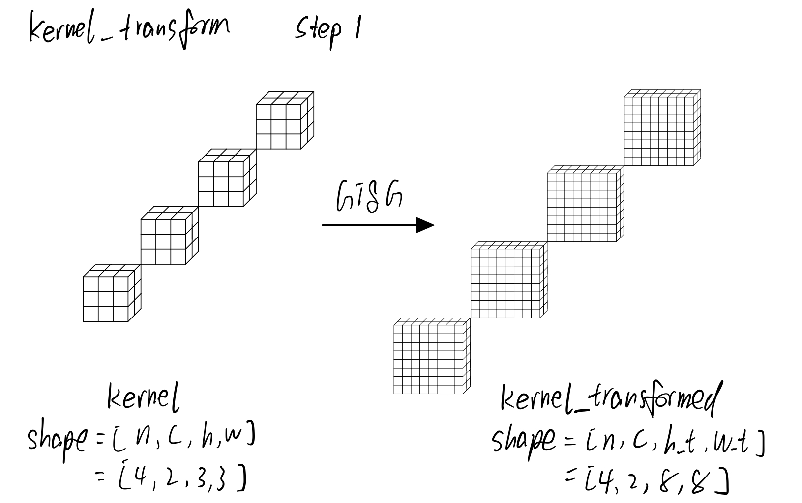

<center>图1.kernel_transform step1</center>

对于一个nchw排布的kernel, 先根据公式$U=GgG^T$对3x3的卷积核$g$进行了转换得到8x8的尺寸. 其实这个过程是可以推理之前做好存储起来的, 所以即使用最慢的矩阵乘法也是可以的. 
$$
G =
\left[
\begin{matrix}
1 & 0 & 0\\
-\frac{2}{9} & -\frac{2}{9} & -\frac{2}{9} \\
-\frac{2}{9} & \frac{2}{9} & -\frac{2}{9} \\
\frac{1}{90} & \frac{1}{45} & \frac{2}{45} \\
\frac{1}{90} & -\frac{1}{45} & \frac{2}{45} \\
\frac{32}{45} & \frac{16}{45} & \frac{8}{45} \\
\frac{32}{45} & -\frac{16}{45} & \frac{8}{45} \\
0 & 0 & 1\\
\end{matrix}
\right]

\qquad

G^T =
\left[
\begin{matrix}
1 & -\frac{2}{9} & -\frac{2}{9} & \frac{1}{90} & \frac{1}{90} & \frac{32}{45} & \frac{32}{45} & 0\\
0 & -\frac{2}{9} & \frac{2}{9} & \frac{1}{45} & -\frac{1}{45} & \frac{16}{45} & \frac{16}{45} & 0\\
0 & -\frac{2}{9} & -\frac{2}{9} & \frac{2}{45} & \frac{2}{45} & \frac{8}{45} & \frac{8}{45} & 1\\
\end{matrix}
\right] \tag{2}
$$
由于这部分ncnn的实现也是很简单粗暴的矩阵乘法, 因此就不做过多解释

```c
static void conv3x3s1_winograd64_transform_kernel_neon5(const Mat& kernel, Mat& kernel_tm, int inch, int outch){
    //......
    const float ktm[8][3] = {
        {1.0f, 0.0f, 0.0f},
        {-2.0f / 9, -2.0f / 9, -2.0f / 9},
        {-2.0f / 9, 2.0f / 9, -2.0f / 9},
        {1.0f / 90, 1.0f / 45, 2.0f / 45},
        {1.0f / 90, -1.0f / 45, 2.0f / 45},
        {1.0f / 45, 1.0f / 90, 1.0f / 180},
        {1.0f / 45, -1.0f / 90, 1.0f / 180},
        {0.0f, 0.0f, 1.0f}
    };
    //......
    float tmp[8][3];
    for (int i = 0; i < 8; i++) {
        tmp[i][0] = k0[0] * ktm[i][0] + k0[1] * ktm[i][1] + k0[2] * ktm[i][2];
        tmp[i][1] = k1[0] * ktm[i][0] + k1[1] * ktm[i][1] + k1[2] * ktm[i][2];
        tmp[i][2] = k2[0] * ktm[i][0] + k2[1] * ktm[i][1] + k2[2] * ktm[i][2];
    }
    //......
    for (int j = 0; j < 8; j++){
        float* tmpp = &tmp[j][0];
        for (int i = 0; i < 8; i++) {
            kernel_tm0[j * 8 + i] = tmpp[0] * ktm[i][0] + tmpp[1] * ktm[i][1] + tmpp[2] * ktm[i][2];
        }
    }
    //......
}

```

### step2

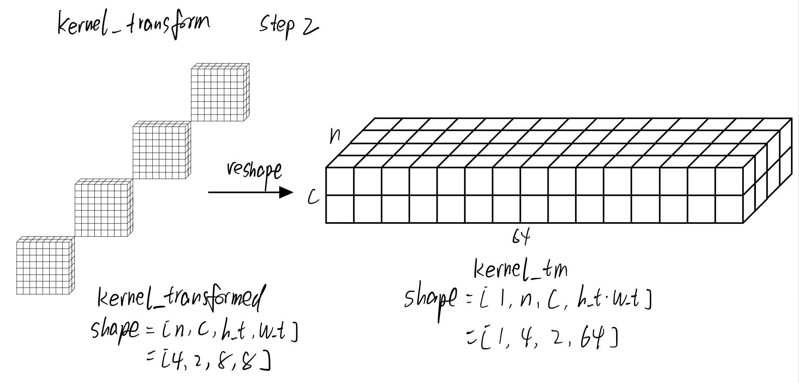

<center>图2.kernel_transform step2</center>

这一步就是reshape的过程, 其实就是将原本的hw两个维度合并成一个w维度, 不改变元素在内存中的排列顺序. 看图应该就很直观

### step3

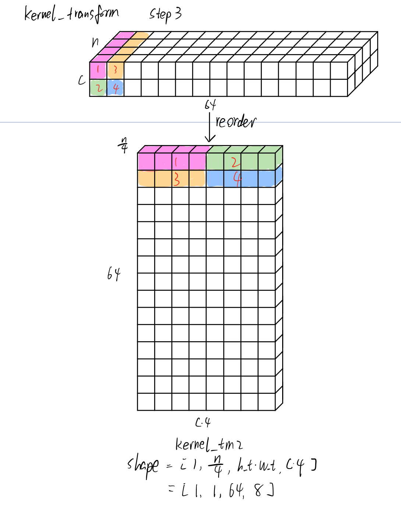

<center>图3.kernel_transform step3</center>

这一步是一个reorder的过程, 是改变元素排列顺序的. 这个过程用文字描述就是: reorder前沿着n这个维度每4个为一组, 横着放到reorder后的一行上, 这一行由多个c的这样的组构成. 每一行代表[8x8]tile块的一个元素, 

## 步骤二: input_transform

### step1

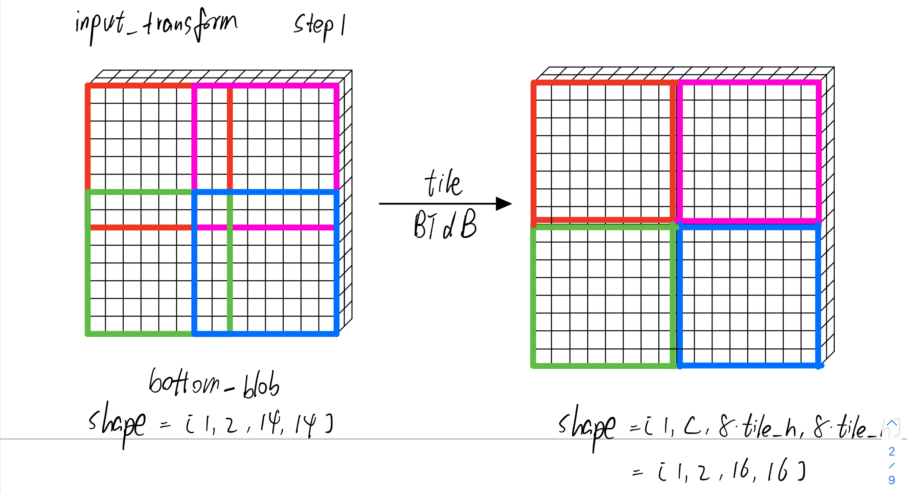

<center>图4.input_transform step1</center>

这一步包含两个操作, 第一个操作是将输入bottom_blob划分成多个tile, 第二个操作是对每个tile根据公式$V=B^TdB$完成transform. 由于transform前后每个tile都是8x8的尺寸, 所以图4中就将这两个操作合在一起了. 划分tile不多说, 重点讲讲这个transform的过程.

首先看计算$dB$的矩阵乘

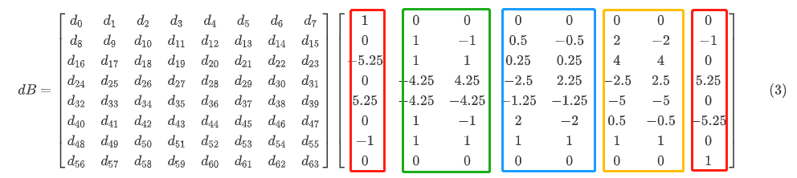

我们观察矩阵$B$, 根据其数值特点将其划分为4块

+ 红色列有两个数值特点:

  1. 很多0和1

  2. 列内系数成对出现(不考虑正负号)

   分布在左右的红色两列需要分别计算. 在计算红色第一列时根据特点1可以利用[上一篇]()提到思路三**"很多0和正负1, 其实我是可以不用乘的. 固定死写成加法即可"**减少乘法操作数量, 同时根据特点2列内系数成对出现, 可以**"乘法合并", 先加减后乘除**, 进一步降低乘法操作数量.
  $$
  \begin{aligned}
  (dB)_0 &= 1*d_0+0*d_1-5.25*d_2+0*d_3+5.25*d_4+0*d_5-d_6*1+0*d_7\\
  &=d_0-5.25*d_2+5.25*d_4-d_6\\
  &=d_0-d6+5.25*(d4-d2)
  \end{aligned} \tag{4}
  $$

+ 绿色列的特点除了红色列具有的上述两个特点外还有第三个特点:

  3. 两列之间的差异只是部分符号相反

  $$
  \begin{aligned}
  (dB)_1 &= d_1+d_2-4.25*d_3-4.25*d_4+d_5+d_6\\
  &=(d_2+d_6-4.25*d_4)+(d_1+d_5-4.25*d_3)\\
  &=a+b\\
  \end{aligned} \tag{5}
  $$

  $$
  \begin{aligned}
  (dB)_2 &= -d_1+d_2+4.25*d_3-4.25*d_4-d_5+d_6\\
  &=(d_2+d_6-4.25*d_4)-(d_1+d_5-4.25*d_3)\\
  &=a-b\\
  \end{aligned} \tag{6}
  $$

  你看公式5和公式6所表示的计算绿色第一列和第二列, 是可以提炼出公共部分a和b, 因此又可以合并计算降低乘法操作数量. 蓝色列与黄色列同理.

再看计算$B^T(dB)$的矩阵乘, 同理不赘述

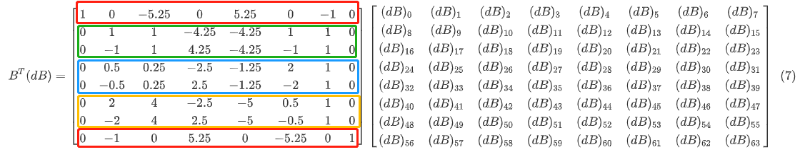

此时再看代码, 就一目了然了

```c++
static void conv3x3s1_winograd64_neon5(const Mat& bottom_blob, Mat& top_blob, const Mat& kernel_tm, const Mat& _bias, const Option& opt){
    //...
    //计算dB
    for (int m = 0; m < 8; m++) {
        // 红色两列
        tmp[0][m] = r0[0] - r0[6] + (r0[4] - r0[2]) * 5.25f;
        tmp[7][m] = r0[7] - r0[1] + (r0[3] - r0[5]) * 5.25f;

        // 绿色两列
        float tmp12a = (r0[2] + r0[6] - r0[4] * 4.25f);
        float tmp12b = (r0[1] + r0[5] - r0[3] * 4.25f);
        tmp[1][m] = tmp12a + tmp12b;
        tmp[2][m] = tmp12a - tmp12b;

        // 蓝色两列
        float tmp34a = (r0[6] + r0[2] * 0.25f - r0[4] * 1.25f);
        float tmp34b = (r0[1] * 0.5f - r0[3] * 2.5f + r0[5] * 2.f);
        tmp[3][m] = tmp34a + tmp34b;
        tmp[4][m] = tmp34a - tmp34b;

        // 黄色两列
        float tmp56a = (r0[6] + (r0[2] - r0[4] * 1.25f) * 4.f);
        float tmp56b = (r0[1] * 2.f - r0[3] * 2.5f + r0[5] * 0.5f);
        tmp[5][m] = tmp56a + tmp56b;
        tmp[6][m] = tmp56a - tmp56b;

        r0 += w;
    }
    //...
    //计算BT(dB)
    for (int m = 0; m < 8; m++) {
        const float* tmp0 = tmp[m];
		// 红色两列
        r0_tm_0[0] = tmp0[0] - tmp0[6] + (tmp0[4] - tmp0[2]) * 5.25f;
        r0_tm_7[0] = tmp0[7] - tmp0[1] + (tmp0[3] - tmp0[5]) * 5.25f;
		
        // 绿色两列
        float tmp12a = (tmp0[2] + tmp0[6] - tmp0[4] * 4.25f);
        float tmp12b = (tmp0[1] - tmp0[3] * 4.25f + tmp0[5]);
        r0_tm_1[0] = tmp12a + tmp12b;
        r0_tm_2[0] = tmp12a - tmp12b;

        // 蓝色两列
        float tmp34a = (tmp0[6] + tmp0[2] * 0.25f - tmp0[4] * 1.25f);
        float tmp34b = (tmp0[1] * 0.5f - tmp0[3] * 2.5f + tmp0[5] * 2.f);
        r0_tm_3[0] = tmp34a + tmp34b;
        r0_tm_4[0] = tmp34a - tmp34b;
		
        // 黄色两列
        float tmp56a = (tmp0[6] + (tmp0[2] - tmp0[4] * 1.25f) * 4.f);
        float tmp56b = (tmp0[1] * 2.f - tmp0[3] * 2.5f + tmp0[5] * 0.5f);
        r0_tm_5[0] = tmp56a + tmp56b;
        r0_tm_6[0] = tmp56a - tmp56b;
        //...
    }
    //...
}
```

### step2


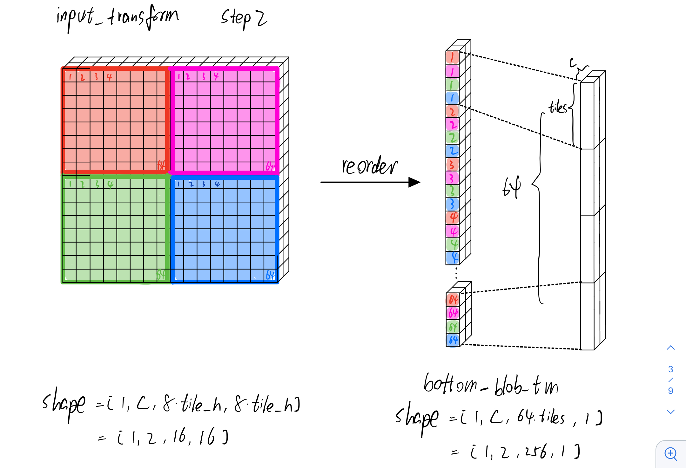

<center>图5.input_transform step2</center>

第二步是一个内存重排的操作. 把每个tile的同一位置的元素连在一起形成一个块, 本文称其为"tiles块"(注意区分前面说的"tile块"). 同时tiles也代表tile的数量, 图5中等于4.

### step3

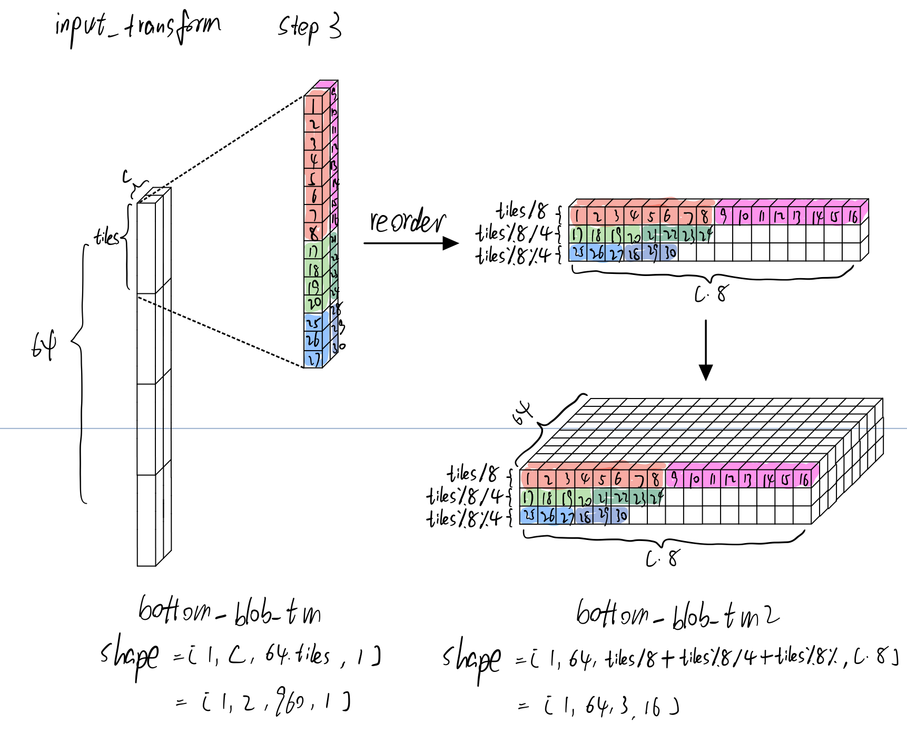

<center>图6.input_transform step3</center>

第三步又是一个内存重排. 首先你可能会疑惑, 为什么第二步做了内存重排, 紧接着第三步又做了内存重排, 不能一步到位直接排成想要的样子么? 其实ncnn的代码中没有第二步, 而是对每个tile块矩阵乘之后直接排成了第二步图5里的bottom_blob_tm的样子. 我特地增加第二步是为了容易理解.

继续讲第三步的内存重排. 为了说明该步的操作细节, 将之前输入的4个tile块变成15个tile块. 其实重排的过程图6已经用不同的颜色块表示的比较清晰了. 一定要用语言来描述这个重排的过程话那就是: 对于bottom_blob_tm的每个tiles块, 沿着竖的h维度每8个元素划为一个"大块"(图6中红色的1-8表示), 横着放到bottom_blob_tm2的w维度上, 同时需要把其余c维度的"大块"也跟在w维度后面. tiles块剩下不足以构成8个元素的"大块", 就每4个元素构成一个"中块"(图6中绿色的17-20表示), 然后剩下不足以构成"中块"就以元素为单位同样操作(图6中蓝色的25-27表示). 

## 步骤三: multi

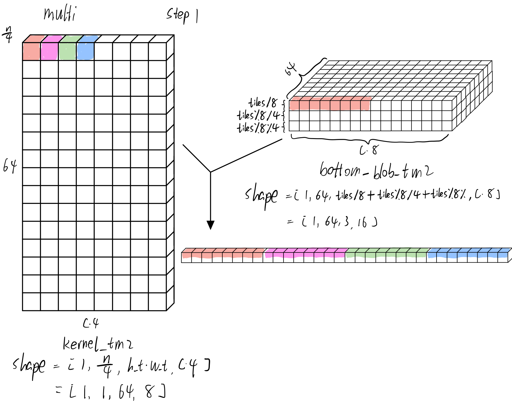

<center>图7.multi step1</center>

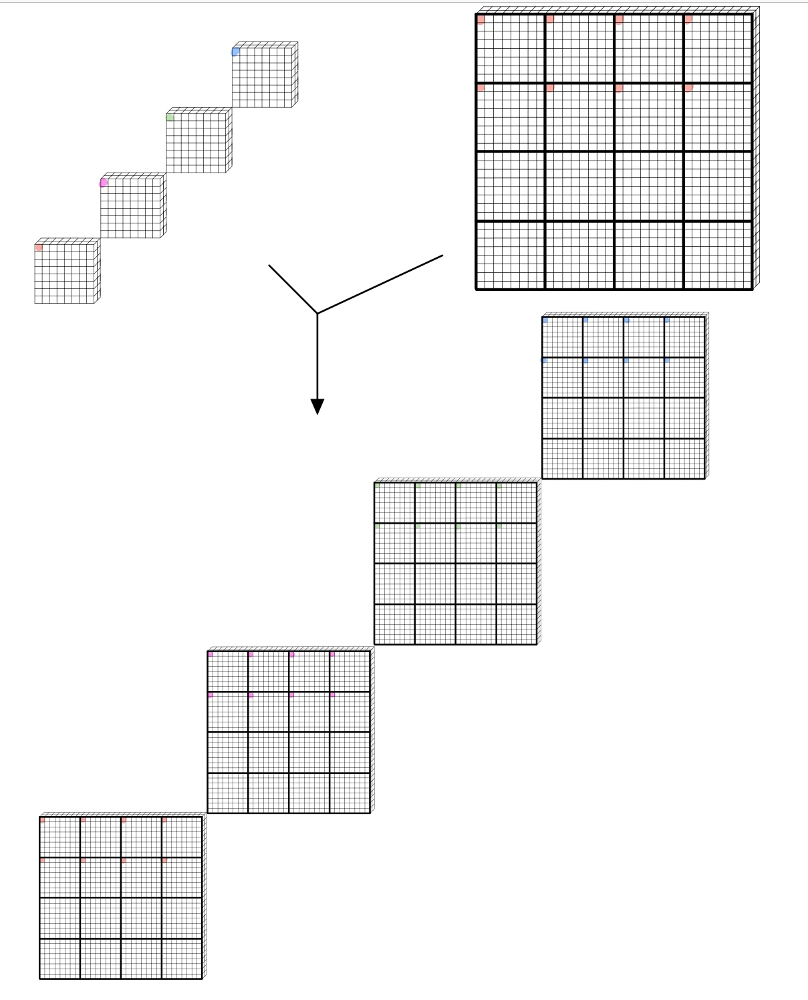

<center>图8.与图7等效的未transform的multi操作</center>

然后进行两个矩阵的点对点相乘. 这两个矩阵分别是步骤一讲的卷积核kernel经过transform之后得到的矩阵kernel_tm2和步骤二讲的输入bottom_blob经过transform之后得到的bottom_blob_tm2, 也就是Winograd结论公式$Y=A^T[(GgG^T)⊙(B^TdB)]A =A^T[U⊙V]A=A^TMA$里的$U$和$V$. 我们需要比较清楚的了解这两个transform之后的矩阵中每个元素对应于transform之前是什么位置的, 才能理解这个操作的正确性. 然后进一步理解经过transform之后实现点对点相乘操作的高效性. 如图7所示, kernel_tm2里所涂色的4个颜色块表示原始矩阵kernel中"4个chw卷积核, 并且各个卷积核的8x8hw矩阵的第0个元素", bottom_blob_tm2里涂色的8个颜色块表示原始矩阵bottom_blob中"8个不同8x8tile矩阵的第0个元素". 图7的操作可以按照以下描述: kernel_tm2的4个颜色块分别与bottom_blob_tm2的8个颜色块进行乘法, 结果保存到一个长度为4*8的临时变量中. 之所以没有把这个临时变量涂色涂完全, 是因为现在只计算了第0个c, 我们知道卷积的时候需要沿着c维度进行累加. 还需要图9所示将第1个c结果也累加起来, 这个临时变量才算是完全. 图7表示的经过transform后的multi操作等效于图8表示的未经transform的multi操作.

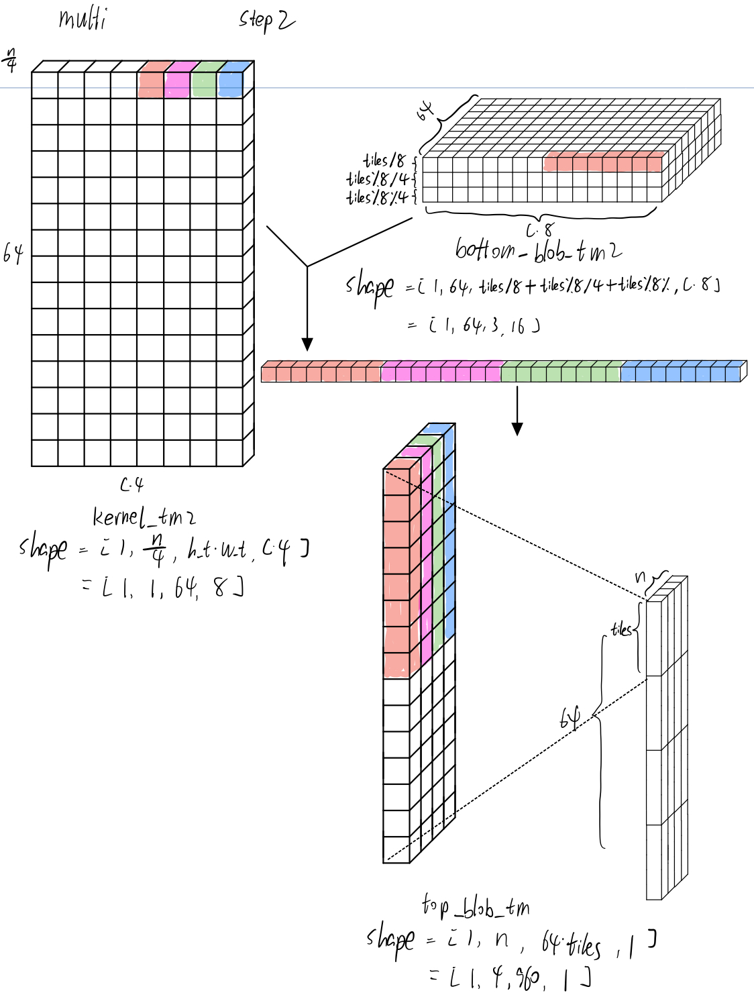

<center>图9.multi step2</center>

图9表示所有的c都累加到临时变量后才构成完全上色的完整的临时变量, 然后将这个临时变量保存到长的很类似bottom_blob_tm的top_blob_tm中. 图9应该描述的很清楚.

## 步骤四: ouput_transform

$$
Y=A^T[(GgG^T)⊙(B^TdB)]A =A^T[U⊙V]A=A^TMA
$$

$$
MA =
\left[
\begin{matrix}
m_0 & m_1 & m_2 & m_3 & m_4 & m_5 & m_6 & m_7\\
m_8 & m_9 & m_{10} & m_{11} & m_{12} & m_{13} & m_{14} & m_{15}\\
m_{16} & m_{17} & m_{18} & m_{19} & m_{20} & m_{21} & m_{22} & m_{23}\\
m_{24} & m_{25} & m_{26} & m_{27} & m_{28} & m_{29} & m_{30} & m_{31}\\
m_{32} & m_{33} & m_{34} & m_{35} & m_{36} & m_{37} & m_{38} & m_{39}\\
m_{40} & m_{41} & m_{42} & m_{43} & m_{44} & m_{45} & m_{46} & m_{47}\\
m_{48} & m_{49} & m_{50} & m_{51} & m_{52} & m_{53} & m_{54} & m_{55}\\
m_{56} & m_{57} & m_{58} & m_{59} & m_{60} & m_{61} & m_{62} & m_{63}\\
\end{matrix}
\right]

\left[
\begin{matrix}
1 & 0 & 0 & 0 & 0 & 0\\
1 & 1 & 1 & 1 & 1 & 1\\
1 & -1 & 1 & -1 & 1 & -1\\
1 & 2 & 4 & 8 & 16 & 32\\
1 & -2 & 4 & -8 & 16 & -32\\
32 & 16 & 8 & 4 & 2 & 1\\
32 & -16 & 8 & -4 & 2 & -1\\
0 & 0 & 0 & 0 & 0 & 1\\
\end{matrix}
\right]
$$

计算的过程跟前面计算$dB$的思路是一样的, 不赘述了. 也是**"0和1不用乘"**以及**"提炼公共部分"**, 至于这个公共部分, 就看代码吧

```c++
// 计算MA
for (int m = 0; m < 8; m++) {
    // 3对6个公共部分
    float tmp024a = output0_tm_1[0] + output0_tm_2[0];
    float tmp135a = output0_tm_1[0] - output0_tm_2[0];

    float tmp024b = output0_tm_3[0] + output0_tm_4[0];
    float tmp135b = output0_tm_3[0] - output0_tm_4[0];

    float tmp024c = output0_tm_5[0] + output0_tm_6[0];
    float tmp135c = output0_tm_5[0] - output0_tm_6[0];

    // 结果都是用带上系数的公共部分组合而成
    tmp[0][m] = output0_tm_0[0] + tmp024a + tmp024b + tmp024c * 32;
    tmp[2][m] = tmp024a + tmp024b * 4 + tmp024c * 8;
    tmp[4][m] = tmp024a + tmp024b * 16 + tmp024c + tmp024c;

    tmp[1][m] = tmp135a + tmp135b + tmp135b + tmp135c * 16;
    tmp[3][m] = tmp135a + tmp135b * 8 + tmp135c * 4;
    tmp[5][m] = output0_tm_7[0] + tmp135a + tmp135b * 32 + tmp135c;
    // ...
}

// 计算AT(MA)
for (int m = 0; m < 6; m++){
    const float* tmp0 = tmp[m];

    float tmp024a = tmp0[1] + tmp0[2];
    float tmp135a = tmp0[1] - tmp0[2];

    float tmp024b = tmp0[3] + tmp0[4];
    float tmp135b = tmp0[3] - tmp0[4];

    float tmp024c = tmp0[5] + tmp0[6];
    float tmp135c = tmp0[5] - tmp0[6];

    output0[0] = bias0 + tmp0[0] + tmp024a + tmp024b + tmp024c * 32;
    output0[2] = bias0 + tmp024a + tmp024b * 4 + tmp024c * 8;
    output0[4] = bias0 + tmp024a + tmp024b * 16 + tmp024c + tmp024c;

    output0[1] = bias0 + tmp135a + tmp135b + tmp135b + tmp135c * 16;
    output0[3] = bias0 + tmp135a + tmp135b * 8 + tmp135c * 4;
    output0[5] = bias0 + tmp0[7] + tmp135a + tmp135b * 32 + tmp135c;

    output0 += outw;
}
```

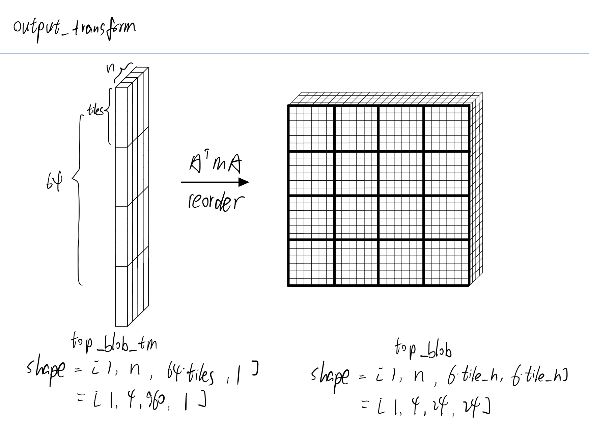

<center>图10.output transform</center>

## 总结

本文主要讲了ncnn实现Winograd的算法, 该实现主要包含两个部分, 一个是Winograd公式的矩阵之间的优化计算方式, 另外一个是为了SIMD操作优化而作的内存重排. 前者本文是通过展示矩阵乘公式以及附上ncnn实现代码完成了对应说明, 后者本文通过多幅图完成了形象说明. 希望能帮助大家更好的理解Winograd卷积