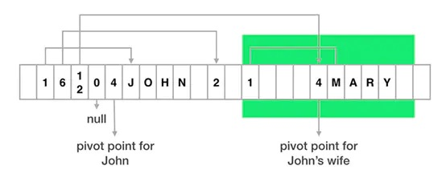
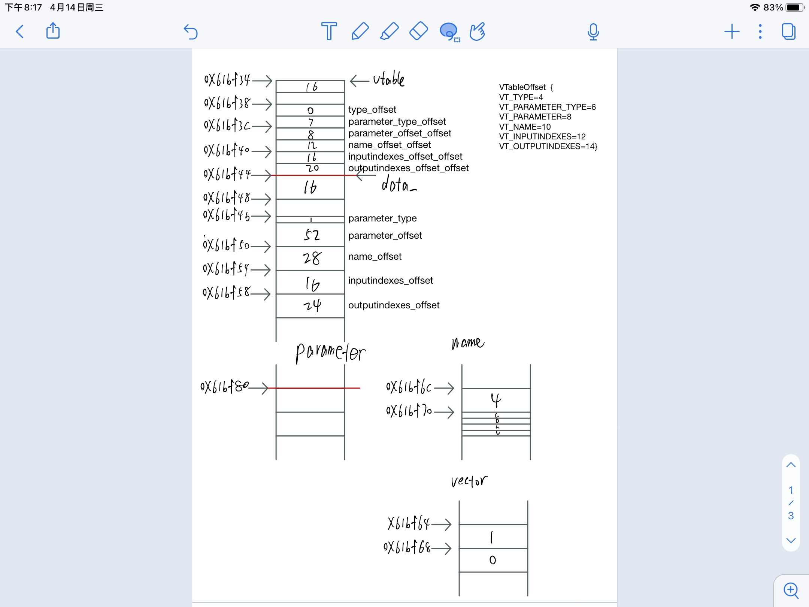
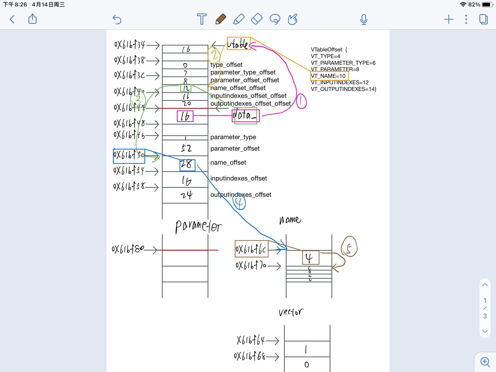

# 序列化与反序列化之Flatbuffers（二）：深入剖析
## 一: 前言
上一篇介绍了Flatbuffers的基本情况和基本使用方法, 现在我们对这个序列化的过程比较感兴趣, 或者说想要知道序列化后这个信息是以什么样形式存储起来了. 在网上也看到一些讲Flatbuffers内部保存结构的, 基本都用的下面这样一张图. 这张图基本意思是对了, 但是细节上不对的!!!!!!!我不知道是否是因为版本迭代的缘故, 至少目前2021年4月最新的Flatbuffers细节上与那张图不一样.
## 二: 回顾

```c
table Person {
  name: string;
  friendshipStatus: FriendshipStatus = Friend;
  spouse: Person;
  friends: [Person];
}
```
>可见，FlatBuffers 保存在一个 byte 数组中，有一个“支点”指针（pivot point）以此为界，存储的内容分为两个部分：元数据和数据内容。其中元数据部分就是数据在前面，其长度等于对象中的字段数量，每个 byte 保存对应字段内容在数组中的索引（从支点位置开始计算）。
如图，上面的 Person 对象第一个字段是 name，其值的索引位置是 1，所以从索引位置 1 开始的字符串，就是 name 字段的值 "John"。第二个字段是 friendshipStatus，其索引值是 6，找到值为 2， 表示 NotFriend。第三个字段是 spouse，也一个 Person 对象，索引值是 12，指向的是此对象的支点位置。第四个字段是一个数组，图中表示的数组为空，所以索引值是 0。  
作者：孤独的根号十二
链接：https://www.jianshu.com/p/8366f39b853c
来源：简书
著作权归作者所有。商业转载请联系作者获得授权，非商业转载请注明出处。

首先, 上述有几点是对的:
1. 数据都以一维byte数组中保存
1. "支点"指针（pivot point）概念和"元数据"和"数据内容"的概念都是对的

但是还有一些错误和不足:
1. 并不是所有的数据结构都是直接放在"支点"后面的"数据内容"区, 至少string不是, 所以那个John画的位置不对
1. 图示画的比较粗糙, 我并不知道每个格子到底占几个字节
1. 没有将常见的union, vector等数据结构画出来

接下来让我来画个更详细的图, 看完保证能懂!!!!
## 三: 预备
我们继续以上一篇中Op的结构为例, 看看int, enum, union, string, vector, table是如何保存的
```c
table Conv {
    kernelX:int = 1;
    kernelY:int = 1;
    // ...
}
union OpParameter {
    Conv,
    Pool,
}
enum OpType : int {
    Conv,
    Pool,
}
table Op {
    type: OpType;
    parameter: OpParameter;
    name: string;
    inputIndexes: [int];
    outputIndexes: [int];
}
```
这是之前定义的Op的fbs
```c
enum FlatBuffersVTableOffset FLATBUFFERS_VTABLE_UNDERLYING_TYPE {
    VT_TYPE = 4,
    VT_PARAMETER_TYPE = 6,
    VT_PARAMETER = 8,
    VT_NAME = 10,
    VT_INPUTINDEXES = 12,
    VT_OUTPUTINDEXES = 14
  };
```
这是生成的.h文件里Op的一个偏移结构
```c
PiNet::Op* ConvOp = net->oplists()->Get(0);
//auto ConvOpT = ConvOp->UnPack();
```
这是代码中我们获得这个Op指针的方法, 我注掉了第二句Unpack, 因为我们接下来讲的就是这个Unpack内部是如何根据TableOffset和Op*实现反序列化的

## 四: 正文

先上图. 是Op这个table的内存分布图, 较大的每格矩形代表4个字节, 较小的代表2个字节, 代表1个字节和3个字节的矩形在图中都只有一个. 大小应该是比较按比例的, 也可以根据左侧的地址计算. 矩形中的内容代表该内存块包含的内容, 都是十进制整型. 右侧是我对每格自己取的名字, 以便后续的讲解. 现在给你这幅图, 然后告诉你红线标注的地址0x61bf44就是Op的指针data_, 以及右侧的Tableoffset, 你来告诉我这个OpT(序列化之前)的各个成员包括OpT.type, OpT.parameter_type, OpT.parameter, OpTname, OpT.inputindexes, OpT.outputindexes分别是多少. 这就是反序列化的工作目标.

好, 我们一步步来讲
1. 读vtable的size.首先从"支点"data_开始读取4个字节的int32. 图中可以看出是16, 也就是说"元数据"区域的大小是16个字节
1. 计算vtable. 16换算成十六进制是0x10. 以data_为第一次寻址基址, 0x10为第一次偏移量, 第一次寻址加载得到"元数据"区域的起始地址vtable=data_-0x10=0x61bf34. 同时我们也发现, 这里的int16(双字节)存放的内容也是vtable的size 16
1. 获取enum类型的OpT.type值. 从vtableoffset得知VT_TYPE是4, 则以vtable为第二次寻址基址, VT_TYPE为第二次偏移量, 第二次寻址加载得到type_offset = load16(vtable+4)=0. 这里发现第三次偏移量type_offset为0, 则代表type是默认值不用存储, 节省了下面数据区的占用空间. 因此, 我们知道OpT.type = 默认值0即代表Conv类型
1. 获取union.type类型的OpT.parameter_type. VT_PARAMETER_TYPE=6, 则以vtable为第二次寻址基址, VT_PARAMETER_TYPE为第二次偏移量, 第二次寻址加载得到parameter_type_offset = load16(vtable+6)=7, 然后再用这个7作为第三次偏移量, data_作为第三次寻址基址, 寻址到0x61bf4b上, 然后load8得到1, 那么这个代表这个OpT.parameter_type是类型1, 也是代表Conv类型. 由于最后是load8, 也就是存储这个union.type只有1个字节, 也意味着union最大支持类型不能超过255种
1. 获取union类型的OpT.parameter. VT_PARAMETER=8, 则以vtable为第二次寻址基址, VT_PARAMETER为第二次偏移量寻址加载得到parameter_offset = load16(vtable+8)=8, 然后再用这个8作为第三次寻址偏移量, data_作为第三次基址, 第三次寻址到0x61bf4c上, 然后load32得到52, 再然后以52的十六进制0x34为第四次偏移量, 刚刚寻址得到的0x61bf4c为第四次寻址基址, 再第四次寻址得到0x61bf80, 这才是OpT.parameter的值. 我们知道这是一个table, 代表这个0x61bf80是一个新的data_. 再递归进行一次即可获取信息. 观察仔细, 你可以发现, 我把"支点"data_以上的"元数据"区域的名字都加了至少一个offset. 代表这个不是最终我们要的信息, 这只是一个寻址偏移量. 可能要经过多重寻址.
1. 获取string类型的OpTname. 同5一样经过多次寻址后得到一个地址. load32获得这个string的长度, 表示后面跟着几个字符. 然后再第五次寻址得到各个字符
1. 获取vector类型的OpT.inputindexes. 同string
1. 获取vector类型的OpT.outputindexes. 同string


为了便于理解, 我画了寻址次数最多的string为例. 多看几遍应该能够明白

## 五: 总结
上述整个反序列化的过程其实就是一个类似汇编里的"基址变址寻址方式". 不同数据类型需要不同次数的寻址. 这种方式也是Flatbuffers序列化和反序列速度快的根本原因. 同时也对默认值做了一定程度的节省内存