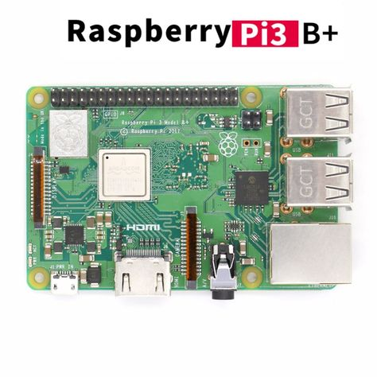

# 前言
&emsp;&emsp;入手一个树莓派Raspberry 3B+后准备拿来当学习嵌入式Linux及深度学习边缘计算的板子，从BootLoader到Linux内核再到深度学习推理框架。本文主要是让树莓派启动Linux内核后开启一个命令行窗口，旨在了解系统启动过程。不用树莓派官方提供图形界面系统。中间走了很多坑，让我们一步步来捋一捋。

# 树莓派的启动流程分析
+ 启动流程<sup>[1]</sup>
  1. First stage bootloader  
树莓派上电后，SoC 中的 bootloader 首先被执行，其作用是挂载 SD 卡上的 FAT32 分区，从而加载下一阶段的 bootloader。这部分程序被固化在 SoC 的 ROM 中，用户无法修改。
  2. Second stage bootloader (bootcode.bin)  
这个阶段的 bootloader 会从 SD 卡上检索 GPU 固件，将固件写入 GPU，随后启动 GPU。
  3. GPU firmware (start.elf) 
本阶段中，GPU 启动后会检索附加配置文件（config.txt、fixup.dat），根据其内容设置 CPU 运行参数及内存分配情况，随后将用户代码加载至内存，启动 CPU。
  4. User code (kernel8.img)  
通常情况下，CPU 启动后便开始执行 kernel8.img 中的指令，初始化操作系统内核，在某些情况下，也可以被 U-BOOT 代替，由 U-BOOT 来加载内核。在树莓派 1 代中，User code 部分被保存在 kernel.img 文件中，2 代中，该文件更名为 kernel7.img，3 代中，该文件更名为 kernel8.img  
  5. 官方的启动流程介绍[链接](https://www.raspberrypi.org/documentation/hardware/raspberrypi/bootmodes/bootflow.md)
+ firmware文件介绍  
SD卡里的boot文件可以在这里下载到官方最新的[链接](https://github.com/raspberrypi/firmware/tree/master/boot)，包含如下文件：  

| 文件 | 作用 |
| ---- | ---- |
| overlays | 存放设备树，必须有|
|bcm2710-rpi-3-b-plus.dtb|设备树文件，根据树莓派型号留一个对应dtb文件的即可|
|bootcode.bin|第二阶段的bootloader，必须存在|
|fixup.dat|[官方介绍链接](https://www.raspberrypi.org/documentation/configuration/config-txt/boot.md)，GPU的Videocore固件。
|start.elf|和fixup是成对使用的，用来GPU的内存|
|kernel.img|系统会先后搜寻config.txt中参数kernel=xxx指定的文件作为接下来接受系统控制权的对象，树莓派默认该文件是linux内核，我们可以替换为用uboot作为新一个bootloader然后再去启动linux内核。如果config.txt里没指定kernel参数，则默认是先后搜寻kernel8.img、kernel8-32.img、kernel7.img、kernel.img，分别对应ARMv8-aarch64、ARMv8-aarch32、ARMv7和之前版本的。
|config.txt|如上面所说，该文件是启动过程第三阶段用来读取参数的。https://www.raspberrypi.org/documentation/configuration/config-txt/boot.md|
|cmdline.txt|是树莓派原生系统启动时传给内核的参数，我们用uboot其实用不着这个|
关于start.elf、fixup.dat文件的x、cd、db后缀的解释，大概是指定GPU使能功能和分配不同内存情况的。[链接](https://github.com/raspberrypi/firmware/issues/959)
>start_x is the full firmware that includes camera and software codecs
It is enabled when start_x=1 is in config.txt  
start_cd is the cutdown firmware that has no support for firmware hardware blocks like codecs and 3d
It is enabled when gpu_mem=16 is in config.txt

+ 小结  
开机后最先执行存储在内部rom里的一段写死的代码用来初始化sd卡读取功能和一些别的基础功能，然后进入sd卡读取boot目录下bootcode.bin文件，该文件配合config.txt、start.elf、fixup.dat文件进一步初始化GPU然后把控制权转交给Linux内核文件kernel.img，我们下文是将kernel.img换成uboot文件然后用uboot再初始化一些功能（感觉跟前面会有点重复）后再读取我们自己准备的Linux内核进行启动。由于树莓派的bootloader不开源，所以我们前面可以不管，我们可以着重关注更常用的uboot和Linux启动过程，这样学到的东西更加通用和开源  
+ TODO
<font color=red>TODO：config.txt里可选参数分析  
TODO：确认config.txt和改uboot名为kernel8.img是否有区别  
TODO：bootcode.bin使能了uart后还是不能输出详细的初始化信息  
TODO：除了sd卡启动还有别的启动方式，GPIO boot mode[链接](https://www.raspberrypi.org/documentation/hardware/raspberrypi/bootmodes/gpio.md)</font>

# 串口、网络调试环境准备
1. TFTP用作让树莓派的uboot通过网络读取主机里准备好的Linux内核，这样相比用从sd卡读取内核在调试的时候不需要频繁的插拔sd卡  
[具体操作参考这篇博文](https://blog.csdn.net/zengxiaohua123/article/details/80614950)
2. NFS用做让Linux内核通过网络挂载主机里准备好的根目录，方便调试。
   ``` bash
   sudo apt-get install nfs-kernel-server rpcbind
   mkdir /home/hsq/Public/nfs
   ```  
   在自己的Public文件夹下创建nfs用作共享目录
   + ```sudo vim /etc/exports```  
     添加内容：  
     ```/home/hsq/Public/nfs *(rw,sync,no_root_squash)```
   + ```sudo /etc/init.d/nfs-kernel-server restart```  
   重启服务即可
   +  ```mount -t nfs 192.168.1.105:/home/hsq/Public/nfs ~/tmp```  
   测试挂载，没报错可以进入即成功。192那个是nfs服务器的本地ip
      ``` bash
      mount -t nfs -o nolock 192.168.1.105:/home/hsq/Public/nfs ~/tmp```
      ```
3. 串口minicom
  <font color=red>TODO:让linux启动阶段的信息也通过串口输出来</font>
# 准备交叉编译环境
+ 参考我之前文章[交叉编译器命名规律及使用](https://blog.csdn.net/hsqyc/article/details/104707154)，本次准备编译aarch64的内核，因此选择下载的编译器是gcc-arm-8.3-2019.03-x86_64-aarch64-linux-gnu.tar  
然后在.bashrc里添加如下内容，指定交叉编译器路径和编译架构为arm64
  ``` bash
  CROS_COMPILE=arm-linux-gnueabihf-
  ARCH=arm64
  ```


# 编译uboot
+ uboot下载  
可以从官网下载新的，也可以下载我上传到网盘的，里面包含编译好的可直接用的u-boot64.bin
[百度网盘链接](https://pan.baidu.com/s/1XehW4G0EiMHSRAuV2PYQlw)  密码:n83i
+ 编译  
如果自己编译的话，解压压缩包后运行如下命令在文件夹得到u-boot.bin文件，该文件即为最终的编译结果，然后将生成的u-boot.bin文件拷贝到SD卡中的boot文件夹中，在boot中的config.txt中最后添加一行```kernel=u-boot.bin```
  ``` bash
  make rpi_3_b_plus_defconfig #使用3b+的默认配置生产.config文件
  make -j4 #生成u-boot.bin文件
  ```
+ 重点文件分析  
  + configs/
    ``` bash 
    hsq@ares:~/DeepLearning/raiberry/uboot/u-boot-master$ cd configs/
    hsq@ares:~/DeepLearning/raiberry/uboot/u-boot-master/configs$ ls | grep rpi
    rpi_0_w_defconfig
    rpi_2_defconfig
    rpi_3_32b_defconfig
    rpi_3_b_plus_defconfig
    rpi_3_defconfig
    rpi_4_32b_defconfig
    rpi_4_defconfig
    rpi_defconfig
    ```  
    该文件夹下保存着诸多各个板卡的默认uboot配置，也包含树莓派的各个版本默认配置，rpi_3_b_plus_defconfig对应的是64位的，想在树莓派3B+上运行32位uboot，试了rpi_3_32b_defconfig，貌似不行  
    <font color=red>TODO：运行32位uboot</font>  
  + rpi_3_b_plus_defconfig  
    一般不需要修改，目前暂时没有仔细研究过uboot内部细节，以后有机会再回来看吧，立个flag
    
  + .config  
    运行命令```make rpi_3_b_plus_defconfig```得到的.config才是最终编译过程中的配置文件
    ```bash
    ······
    CONFIG_SYS_ARCH="arm"
    CONFIG_SYS_CPU="armv8" #指定架构armv8
    CONFIG_SYS_SOC="bcm283x"
    CONFIG_SYS_VENDOR="raspberrypi"
    CONFIG_SYS_BOARD="rpi"
    ······
    CONFIG_SYS_TEXT_BASE=0x00080000 #说明系统镜像加载的地址
    ······
    ```
    
  
# 编译Linux内核文件
+ 内核下载  
可以从[树莓派官方](https://github.com/raspberrypi/linux)下载新的，也可以下载我上传到网盘的，里面包含编译好的可直接用的镜像文件uImagerpi64
[百度网盘链接](https://pan.baidu.com/s/15etIA1sI-FrBpMx4mmlf3A) 密码:52rs
+ 编译  
根据/arch/arm64/configs里官方编写好的rpi3默认配置文件得到.config文件
  ``` bash
  make ARCH=arm64 bcmrpi3_defconfig #其实之前已经在.bashrc里指定过ARCH是arm64了，这里只是为了显式说明
  make -j4#在/arch/arm64/boot生成内核文件image
  ```
+ 分析
  + /arch/arm64/configs/  
  该文件夹下包含3个64位内核的默认配置文件bcm2711_defconfig、bcmrpi3_defconfig、defconfig，内容很长，具体不分析了，不懂，就看懂第一句这是v8架构的
    ``` bash
    CONFIG_LOCALVERSION="-v8"
    # CONFIG_LOCALVERSION_AUTO is not set
    CONFIG_SYSVIPC=y
    CONFIG_POSIX_MQUEUE=y
    CONFIG_NO_HZ=y
    CONFIG_HIGH_RES_TIMERS=y
    CONFIG_PREEMPT=y
    CONFIG_BSD_PROCESS_ACCT=y
    CONFIG_BSD_PROCESS_ACCT_V3=y
    CONFIG_TASKSTATS=y
    ······
    # 注释掉下面这个log选项，不然启动系统后命令行带的log比较丑
    # CONFIG_LOGO=y
    # CONFIG_LOGO_LINUX_MONO is not set
    # CONFIG_LOGO_LINUX_VGA16 is not set
    ······
    ```
  + .config
  运行上面的命令得到的.config才是最终编译过程中的配置文件
+ <font color=red>TODO：编译出能运行32位系统镜像</font> 
# 制作根目录
参考正点原子哥的教程，38章根文件系统制作。或者直接下载我编译好的
[正点原子教程百度网盘链接](https://pan.baidu.com/s/1sX4VdNr_d9pIcCVsT-rDOg)  密码:rups
[我编译好的根目录链接](https://pan.baidu.com/s/1658ANMNr5wsdOdmcRsaFlg)  密码:ewx0
# 利用uboot启动内核

+ 启动流程
uboot启动后主要需要设置两个参数：1.bootcmd指定去哪里加载需要启动的系统镜像 2.bootargs指定去哪里加载系统镜像所需要的根目录

+ 进入uboot  
sd卡的boot内容如下：  
  ```bash
  hsq@ares:~/boot$ ls
  bcm2710-rpi-3-b-plus.dtb cmdline.txt fixup.dat overlays u-boot64.bin bootcode.bin config.txt kernel7.img start.elf uImagerpi64
  ```

  其中config.txt中需要指定uboot文件名且设置为64位模式，其中u-boot64.bin就是前面编译生成的u-boot.bin
  ```bash
  ······
  arm_64bit=1
  kernel=u-boot64.bin
  ······
  ```
  树莓派上电后倒计时结束前按下回车看到如下输出即为成功启动uboot：
  ```bash
  Hit any key to stop autoboot:  0 
  U-Boot> 
  ```
  [sd卡里boot文件的链接](https://pan.baidu.com/s/1w84K787vlfeElngL8ZEWAQ)  密码:wim1
+ 设置tftp读取系统镜像
  ```bash
  U-Boot> setenv ipaddr 192.168.1.106
  #echo $ethaddr
  U-Boot> setenv gatewayip 192.168.1.1
  U-Boot> setenv netmask 255.255.255.0
  U-Boot> setenv serverip 192.168.1.105
  U-Boot> saveenv

  U-Boot> setenv bootcmd "tftp 0x80000 uImagerpi64;tftp 0x2600000 bcm2710-rpi-3-b-plus.dtb;bootm 0x80000 - 0x2600000"
  U-Boot> saveenv
  ```
+ 设置sd卡读取系统镜像
  ```bash
  U-Boot> setenv bootcmd "fatload mmc 0:1 0x80000 uImagerpi64;fatload mmc 0:1 0x2600000 bcm2710-rpi-3-b-plus.dtb;bootm 0x80000 - 0x2600000"
  U-Boot> saveenv
  ```
+ 设置nfs挂载主机的根目录启动
  ```bash
  U-Boot> setenv bootargs "console=serial0,115200 console=tty1 root=/dev/nfs rw nfsroot=192.168.1.105:/home/hsq/Public/nfs/rootfs ip=192.168.1.106:192.168.1.105:192.168.1.1:255.255.255.0::eth0:off"
  U-Boot> saveenv
  ```
+ 设置sd卡读取根目录启动
  ```bash
  U-Boot> setenv bootargs "console=serial0,115200 console=tty1 root=/dev/mmcblk0p2 rw rootfstype=ext4 rootwait ip=192.168.1.106::192.168.1.1:255.255.255.0::eth0:off"#没有这里的设置ip就会导致init程序不是最后启动的，比如在一些usb挂载之前
  U-Boot> saveenv
  ```
  [我的关于SD卡格式化的博客](https://blog.csdn.net/hsqyc/article/details/104722365)
+ 启动系统
设置好bootargs和bootcmd后就可以利用命令boot启动系统，倒计时结束后也是自动执行这一句命令
  ```bash
  U-Boot> boot
  ```
  最终看到如下输出即为启动成功：
  <font color=red>TODO:插入启动成功图片</font>
+ boot常用命令  
  [参考链接](https://www.cnblogs.com/x_wukong/p/9244742.html)  
  1. mmc part  
  查看sd卡分区  
  2. fatls mmc 0：1  
  列出sd卡第1个blank的第一个分区的文件夹目录  
  3. fatload mmc 0：1 0x000080000 uImage  
  将sd卡第1个blank的第一个分区的uImage文件加载到0x000080000内存地址中  
  4. tftp   
  4. bootm 0x000080000 - 0x2600000  
  根据0x80000的内核、0x260000的dtb文件启动系统 
  5. printenv  
  显示环境变量  
  6. help  
  显示所有的命令  
  7. reset  
  重启cpu  
  8. setenv bootargs ""  
  设置参数bootargs
  9. saveenv  
  保存修改的参数
  10. ping 192.168.1.105  
  测试网络链接是否正常
+ 小结
  1. uboot里最重要的两个参数是bootargs和bootcmd，前者用于传递给linux内核的信息，后者用于如何启动linux。
  1. 系统镜像所加载的内存位置取决于各个CPU本身，一般设置为和uboot的.config中CONFIG_SYS_TEXT_BASE一样
  1. 用到tftp的话需要设置ip地址等参数
  1. 如果用nfs挂载根目录的话无法使用SSH
# 总结
以上就是如何从零制作一个利用uboot启动树莓派的linux系统镜像。一路采坑无数的同时却也让我对系统启动过程的整体流程有了一定认识，当然，还有很多更细节可以值得深究，这就留给以后吧
# 参考资料
[1][树莓派 3 启动过程概述](https://github.com/Yradex/RaspberryPi3_OS/wiki/%E6%A0%91%E8%8E%93%E6%B4%BE-3-%E5%90%AF%E5%8A%A8%E8%BF%87%E7%A8%8B%E6%A6%82%E8%BF%B0)
[2][BCM2835和BCM2708之间的关系](https://raspberrypi.stackexchange.com/questions/840/why-is-the-cpu-sometimes-referred-to-as-bcm2708-sometimes-bcm2835)