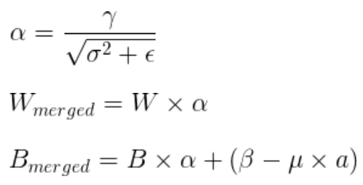
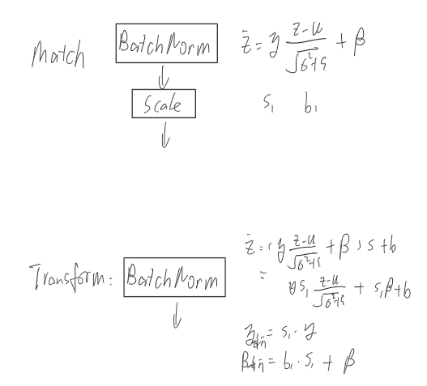
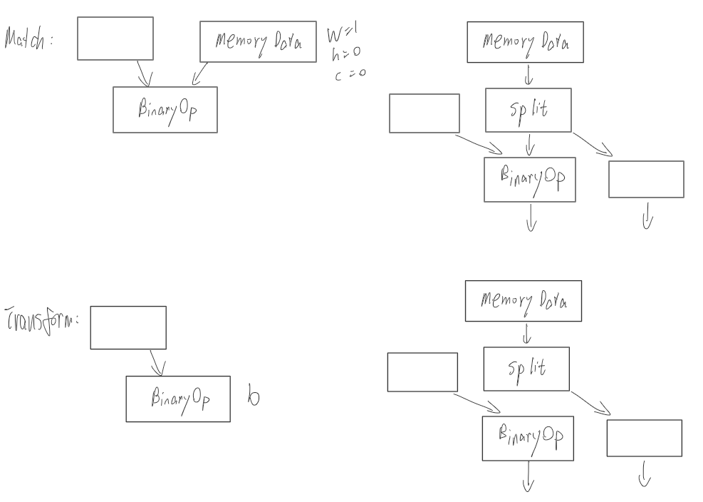
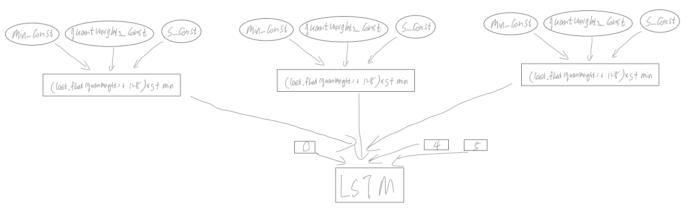

# 图优化
在各种开源推理框架中，我们总能看到有一种graph optimizer技术，主要是对用户想要运行的网络模型进行一种网络结构层面的优化，剔除不需要的Op、融合某些特定的相邻Op、转换某些框架不支持或者实现效率较低的Op等。但是目前网上貌似系统的介绍图优化方向的文章较少，本文是在整理了目前几个开源框架MNN、NCNN、ONNX-Runtime中关于图优化技术后所完成，希望能让大家对图优化有一个大略的了解。
# 前言
1. 本文着重介绍是图优化，对于本文出现的Op的定义不作介绍.这些Op名可能是来自于各种框架  
1. 手画的示意图中矩形代表Op,矩形右边的一般为Op的参数信息，圆形代表tensor。字丑请见谅  
1. 一些图优化的实现是取决于推理框架自身的Op实现情况，并不是说一种推理框架的图优化就一定能用在另外一个推理框架上
1. 每个图优化操作后面都标了来源框架，具体实现可参考下属源代码链接：[MNN图优化源代码1](https://github.com/alibaba/MNN/blob/master/tools/converter/source/optimizer/postconvert)、[MNN图优化源代码2](https://github.com/alibaba/MNN/tree/master/tools/converter/source/optimizer/merge)、[NCNN图优化源代码](https://github.com/Tencent/ncnn/blob/master/tools/ncnnoptimize.cpp)、[ONNX-Runtime图优化源代码](https://github.com/microsoft/onnxruntime/tree/master/onnxruntime/core/optimizer)
1. 整理过程以MNN为主，然后在NCNN和ONNX-Runtime中补充MNN没有的操作
# 正文
## Eliminations删除
+ Op本身无意义  
有些Op本身不参与计算，在推理阶段可以直接去掉对结果没有影响
  + RemoveUnusefulOp(MNN)  
  包括Seq2Out,"Identity", "NoOp", "Print", "Assert", "StopGradient", caffe的Split, Cast转换前后类型相等或者是int32、int64, Concat并且只有输入一个tensor
  

  

  + RemoveDropout(MNN)  
  dropout无需多言了吧
  + eliminate_noop(NCNN)  
  noop是NCNN中定义的forward为空的一种Op
+ Op参数无意义  
有些Op本身是有意义的，但是设置成某些参数后就变成了无意义的了
  + TensorConverterSameMerge(MNN)   
  TensorConverter是MNN里用于转换数据排布格式的Op，当参数src等于dst时该Op无意义可被删除
  

  + Slice Elimination(ONNX-Runtime)  
  当Slice Op的index_start等于0、index_end等于c-1时该Op无意义可被删除  
  + Expand_Elimination(ONNX-Runtime)  
  Expand Op指定的输出shape等于输入shape时该Op无意义可被删除
  

  + eliminate_pooling1x1(NCNN)  
  1x1的pooling无需多言了吧

+ Op位置无意义  
一些Op在一些特殊的位置会变得多余无意义
  + RemoveOutputTensorConvert(MNN)  
  模型的输出不需要进行内存排布转换
  

  + Unsqueeze Elimination(ONNX-Runtime)  
  当Unsqueeze Op的输入是const Op时，可以将const Op进行Unsqueeze操作后直接删除Unsqueeze Op
  

  + eliminate_orphaned_memorydata(NCNN)  
  NCNN里的memorydata就是const Op，当没有其他Op将该const Op作为输入时可认为其为“孤儿”orphaned，可删除
  + eliminate_reshape_before_binaryop(NCNN)  
    TODO:
  + eliminate_reshape_after_global_pooling(NCNN)  
  这里的reshape是flatten,即期望reshape后的tensor的w=1,h=1,c=c,而global_pooling本身输出tensor就是w=1,h=1,c=c，因此可删除reshape
  

  + eliminate_flatten_after_global_pooling(NCNN)  
  同上
  + eliminate_flatten_after_innerproduct(NCNN)  
  innerproduct就是全连接层,输出tensor在NCNN里也是w=1,h=1,c=c,因此后续的flatten可删除
  

+ Op前后重复  
  前后两个相邻的Op都是同一类时，可能只需要一个
  + RemoveDuplicateReshape(MNN)  
  连续的Reshape只需要保留最后一个reshape
  

  + RemoveDuplicatedTensorConvert(MNN)  
  连续的内存排布转换只需要保留最后一个
  

+ Op前后反义
  前后两个相邻的Op进行的操作时相反的时候这两个Op都可以删除
  + EliminateSqueezeExpandDims(MNN)  
  Squeeze和ExpandDims这两个Op是反义的,一个压缩维度，一个是拓展维度，当连续的这两个Op指定的axis相等时即可同时删除这两个Op
  

  + RemoveInverseTensorConverter(MNN)  
  当连续的两个内存排布转换Op的参数前后反义，即src1等于dst2,可同时删除这两个Op
  

  + EliminateQuantAndDequant(MNN)  
  连续进行量化和反量化，可同时删除这两个Op
  

  + Concat_Slice_Elimination(ONNX-Runtime)  
  合并后又进行同样的拆分，可同时删除这两个Op
  

+ 公共子图
  + Common_Subexpression_Elimination(ONNX-Runtime)  
  当模型当中出现了公共子图，如一个输出是另外两个同类型同参数的Op的输入，则可进行删除其中一个Op.Onnx的实现说实话我没太看懂。但是理解起来和实现起来都不难。我自己实现了一版。同时这是一个经典的算法题目，公共子树，有兴趣可自行搜索
  

## Fuse融合
+ Op线性融合  
  相邻的Op存在线性可融合的关系
  + ConvBiasAdd(MNN)  
  Conv Op后跟着的Add Op可以加到Conv里的Bias去
  

  + MergeBNToConvolution(MNN)  
  BN合并大概是图优化里最常用和推理速度提高最大的一个操作，原理不多解释，随便一搜都有各种介绍
  

  

  

  + MergeScaleToConvolution(MNN)  
  Conv Op后跟着的Scale Op可以乘到Conv里的Weight去
  

  + Conv_Mul_Fusion(ONNX-Runtime)  
  同上
  + Matmul_Add_Fusion(ONNX-Runtime)  
  可以用gemm Op代替矩阵乘Matmul+Add，ONNX框架里的gemm公式是Y=alpha* A* B+beta* C
  

  + Matmul_Scale_Fusion(ONNX-Runtime)  
  Matmul的前或者后接一个Scale或者Div都可以融合到Matmul的相乘系数alpha里
  

  + fuse_batchnorm_scale(NCNN)  
  scale的s和b都可以直接融合到bn里去
  

  + fuse_innerproduct_batchnorm(NCNN)  
  bn层合并到全连接层。可以从两种角度看，一个是全连接层可以转成1x1 conv(这个会在下面Transformer里会介绍),bn层可以合并到conv里。另一个角度是bn层可以转换成一个scale层(这个也会在下面Transformer里介绍)，然后scale可以融合到全连接层的weight里  
  a = bias - slope * mean / sqrt(var + eps)  
  b = slope / sqrt(var + eps)  
  value = value * b + a
  

  + fuse_innerproduct_add(NCNN)  
  全连接层后的Add可以融合到全连接层的bias中
  

+ Op激活融合  
把激活操作融合到卷积层中
  + MergeReluToConvolution(MNN)  
  有些框架的激活操作和Conv操作虽然是连续但是计算过程是独立的，在推理的时候是先计算Conv层:"访问"Conv的输出位置，把计算结果放进去,output[i]=Conv(input[i])。然后再计算Relu层:第二次"访问"一遍输出位置，把Relu计算结果放进去，output[i]=Relu[i],这样其实是访问了两遍输出output，增加了访存时间降低了推理效率。如果计算出Conv的结果后立马进行Relu操作，然后把最终结果放到输出位置上，则只需要访存一次。虽然计算量不变，访存量变小，也能提高推理速度。这个优化操作需要卷积层的推理实现支持直接激活
  

  + MergeRelu6ToConvolution(MNN)  
  同上
  + Conv_Activate_Fusion(ONNX-Runtime)  
  同上
+ Op const输入融合  
如果某个Op的输入包含const，则可能进行一些Op融合
  + ConstantFolding(MNN)  
  常量折叠，如果一个Op的所有输入都是const时，可以先计算好结果const代替该Op，而不用每次都在推理阶段都计算一遍
  

  + FoldExpandDimsConst(MNN)  
  如果ExpandDims这个Op指定维度的输入是const，则把这个维度以参数的形式融合到ExpandDims
  

  + fuse_memorydata_binaryop(NCNN)  
  当Binary Op的第二个输入是一个const标量时，把这个标量以参数的形式融合为Binary Op的属性
  

+ Op减少，多变一  
有些Op在一些框架上可能没有直接的实现，而是通过一些Op的组合，如果我自身的框架实现了这个Op，就可以把这些组合转成这个Op，能够使得网络图更加简明清晰
  + FuseLayerNorm(MNN)  
  组合实现的Norm Op直接转换成一个Op
  

  
  + FuseTfPrelu(MNN)  
  组合实现的Prelu Op直接转换成一个Op
  

  + Matmul_transpose_Fusion(ONNX-Runtime)  
  有些框架的矩阵乘法Matmul层自身是不带转置操作的，当需要转置的矩阵乘法时需要前面加一个transpose层。Onnx的Matmul自身有是否转置的参数，因此可以将前面的transpose层转换为参数即可
  

  + fuse_binaryop_eltwise(NCNN)  
  x3 = x1 *b1+x2 *b2，把BinaryOp_Add转换成Eltwise_Sum，而Eltwise_Sum是有参数coeffs的，可以完成上述乘法的效果，因此把两个BinaryOp_Mul的系数融合到Eltwise_Sum的参数coeffs
  

  + replace_reduction_with_global_pooling(NCNN)  
  对一个三维tensor先后两次分别进行w维度的reduction_mean和h维度的reducetion_mean,最终只剩下c这个维度，就等于进行了一次global_mean_pooling
  

## Transformer转换
+ 一变一  
将一个Op转变成另外一个Op，这样做一般能带来性能的提升  
  + ConvertMatMulToConv2D(MNN)  
  将矩阵乘变成Conv，因为一般框架对Conv是做了更多的优化
  

  + TransformInnerProduct(MNN)  
  将全连接层转变成1x1 Conv，因为对Conv做了更多的优化。这个图优化应该也是用的比较多的
  

  + TransformBatchNormal(MNN)  
  BN是等价于Scale Op的,转换成Scale计算量更少，速度更快
  

  + replace_prelu_with_leaky_relu(NCNN)  
  将prelu转变成leaky_relu，对性能应该没啥影响，这么做的原因大概是因为leaky_relu比prelu更加常见吧
  + replace_convolution_with_innerproduct_after_global_pooling(NCNN)  
  TODO:
  + replace_convolution_with_innerproduct_after_innerproduct(NCNN)  
  TODO:  

+ 一变多，为了实现  
这类图优化是与前面的融合优化里的多变一做法相反，将某Op以其他Op组合的形式代替，这样做能减少推理框架需要单独支持的Op的数量
  + TransformShuffleChannel(MNN)  
  ShuffleChannel这个Op没有单独实现而是通过组合Reshape、Permute实现
  

  

  

  + TransformOnnxPad(MNN)  
  将老版onnx的pad-2的pads从参数形式转成输入形式
  

  + ResolveTfShapeN(MNN)  
  将TF框架的ShapeN这个Op通过组合多个Shape的方式实现。
  

  + TransformGroupConvolution(MNN)  
  把组卷积通过组合Slice、Conv实现
  

+ 内存相关
  + AddTensorFormatConverter(MNN)  
  这个是由于MNN倾向采用NC4HW4(C4)的内存排布方式，而其他框架一般采用NCHW和NHWC排布方式，因此一个支持C4排布的Op和不支持C4排布的Op之间需要额外增加一个排布方式转换层。这里会涉及C4排布的概念，这里不多谈论，下次有空单独写一篇
  

  + TurnCompabilityOpAsNC4HW4(MNN)  
  MNN把Op分为三种，只支持C4的、既支持C4又支持原始排布的、只支持原始排布的，遇到第二种时尽量用C4来计算能够提升推理效率
  

  + RemoveInplace(MNN)  
  Inplace是一类Op的统称，这类Op的输入输出为同一tensor，如relu、bn等op都属于inplace，io[i]=Relu(io[i])。这样会使tensor名失去唯一性。比如relu的输入和输出tensor名为relu_tensor，那我在描述网络模型的时候将relu_tensor作为某个Op的输入时就会产生二义性，这个relu_tensor到底是经过relu的还是没有经过relu。因此需要新建一个输出tensor
  

  + ConvertBinaryToElementwise(MNN)  
  TODO:  
  + BinaryAddToEltWise(MNN)  
  TODO:
  + TurnBinaryToElementwise(MNN)  
  TODO:
  + Transformer_Memcpy(ONNX-Runtime)  
  一个const Op如果既作为一个CPU Op的输入，又作为一个GPU Op的输入，不管这个const是存储在CPU Memory里还是存储在GPU Memory里，在另一个设备计算时都会产生一次内存拷贝操作。可以选择增加一个同样的const Op，这样在初始化的时候CPU和GPU上都有这份数据，不需要进行拷贝操作，提高了推理效率
  

+ 量化相关  
跟量化相关的几个图优化操作
  + ConvBNReluFuseToConvInt8(MNN)  
  和BN、Relu好像没有任何关系，就是将多Op实现的ConvInt8转变成ConvInt8
  
  + LSTMWeightInt8(MNN)  
  把LSTM的3个const输入参数量化成int8的形式
  
  
  

  + Conv1dQuantToConv2dQuant(MNN)  
  TODO:
# 思考
对模型利用上述操作逐一进行图优化的过程中，个人觉得应该是个do while的过程，即对于原始模型net进行一遍全部的图优化后得到net2，比较net和net2是否相等，如果不相等则再进行一次循环。这么做是因为可能后进行的图优化操作引入了新的可优化点，只进行一次的话可能会遗漏。但是貌似MNN的图优化流程就只是进行一次